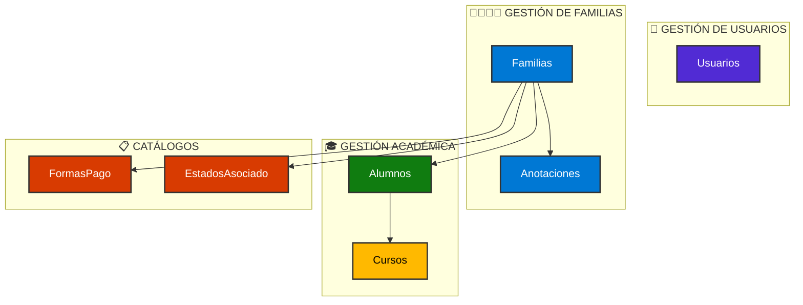
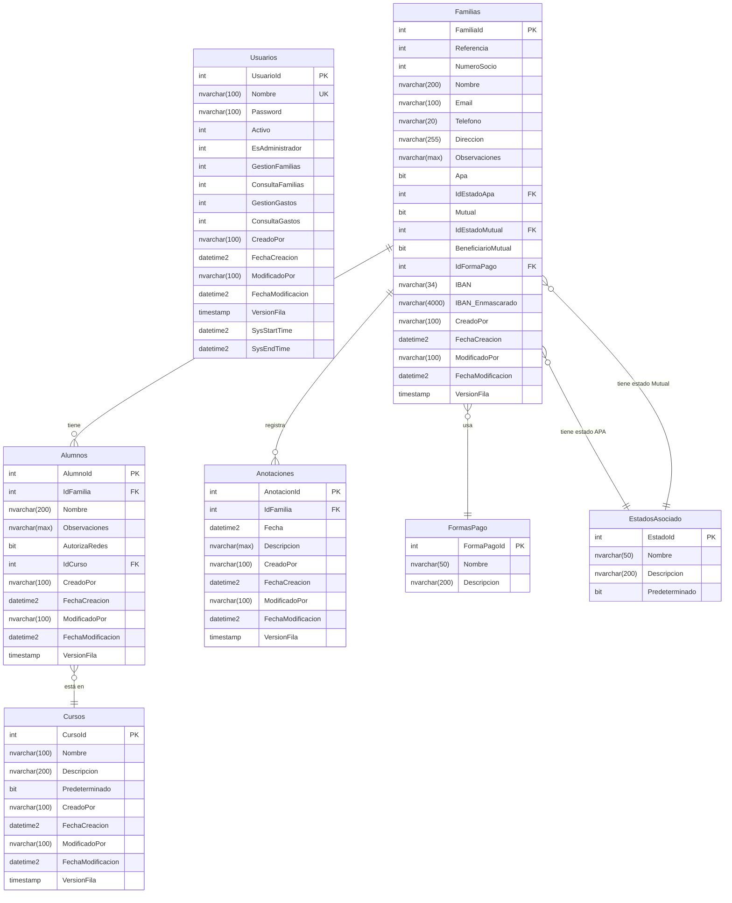
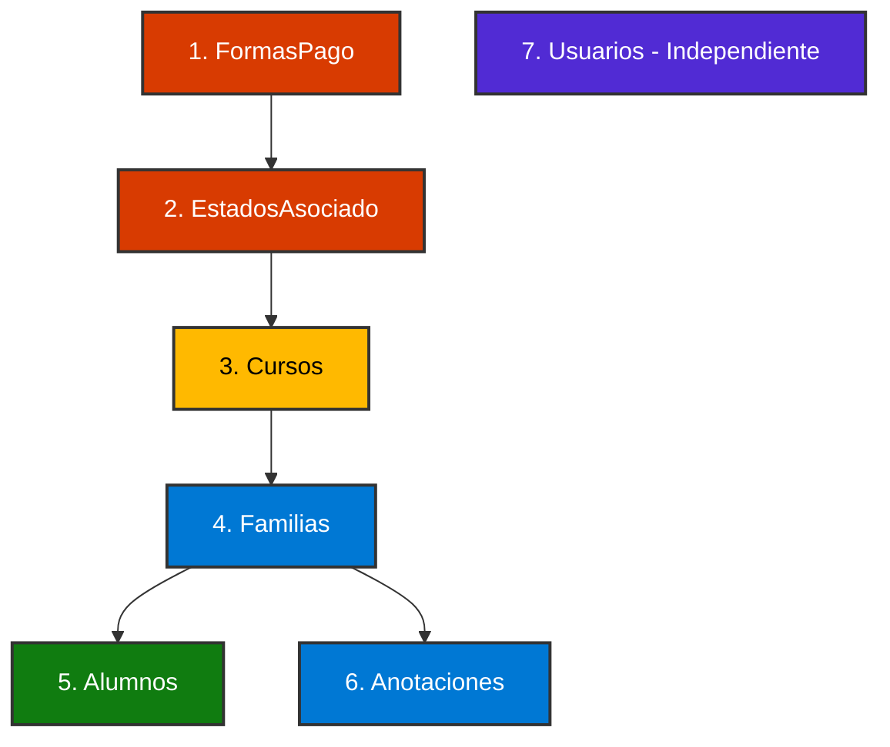
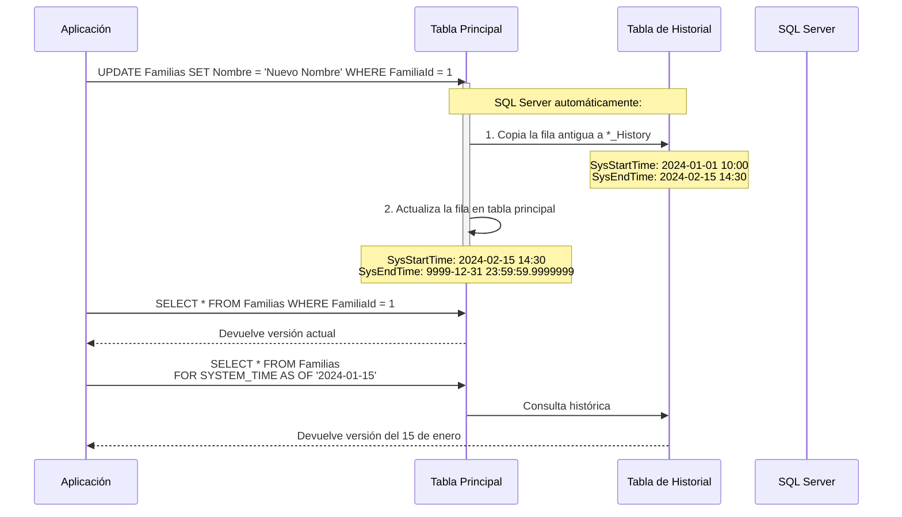
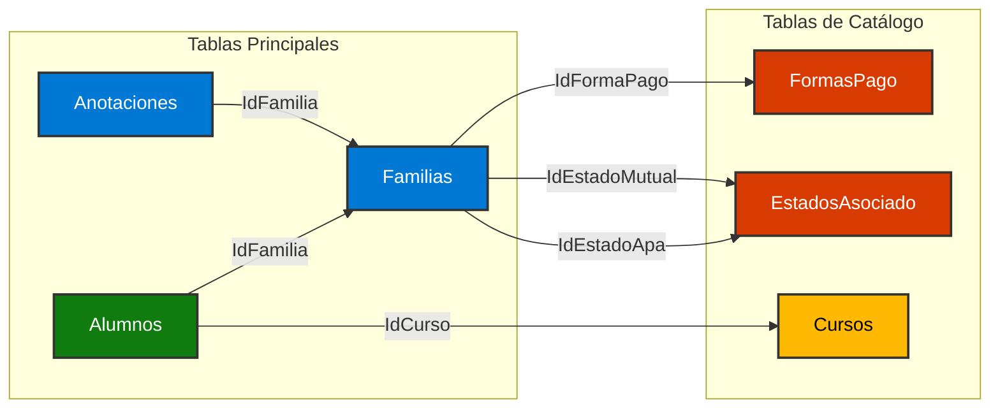
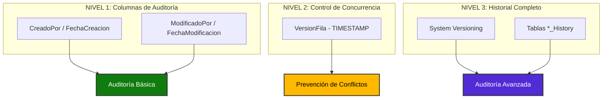
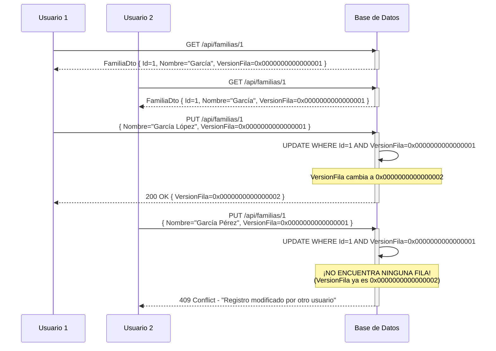

# 🗄️ ESQUEMA DE BASE DE DATOS - KINDOHUB


---

## 📑 Tabla de Contenidos

1. [Visión General](#-visión-general)
2. [Diagrama de Relaciones (ERD)](#-diagrama-de-relaciones-erd)
3. [Catálogo de Tablas](#-catálogo-de-tablas)
4. [Tablas Temporales (System Versioning)](#-tablas-temporales-system-versioning)
5. [Relaciones y Claves Foráneas](#-relaciones-y-claves-foráneas)
6. [Columnas Computadas y Enmascaramiento](#-columnas-computadas-y-enmascaramiento)
7. [Índices y Rendimiento](#-índices-y-rendimiento)
8. [Auditoría y Trazabilidad](#-auditoría-y-trazabilidad)
9. [Configuración de la Base de Datos](#-configuración-de-la-base-de-datos)
10. [Scripts de Mantenimiento](#-scripts-de-mantenimiento)
11. [Mejores Prácticas Implementadas](#-mejores-prácticas-implementadas)

---

## 🎯 Visión General

### Características Principales

**KindoHub Database** es una base de datos SQL Server diseñada para gestionar familias, alumnos y asociaciones educativas con las siguientes características:

| Característica | Descripción | Beneficio |
|----------------|-------------|-----------|
| **🕰️ Temporal Tables** | Historial automático de cambios | Auditoría completa sin código adicional |
| **🔐 Enmascaramiento de Datos** | IBAN parcialmente oculto | Protección de datos sensibles (GDPR) |
| **📊 Columnas de Auditoría** | CreadoPor, FechaCreacion, ModificadoPor, FechaModificacion | Trazabilidad completa de operaciones |
| **🔒 Control de Concurrencia** | VersionFila (TIMESTAMP/ROWVERSION) | Prevención de conflictos de escritura |
| **🔗 Integridad Referencial** | Foreign Keys en todas las relaciones | Consistencia de datos garantizada |
| **🚀 Índices Optimizados** | Clustered index en tablas de historial | Consultas temporales eficientes |

### 📐 Modelo de Datos

La base de datos implementa un modelo relacional normalizado (3NF) con las siguientes entidades principales:



### 🔢 Estadísticas de la Base de Datos

```sql
-- Tablas Principales: 7
-- Tablas de Historial: 5 (Usuarios, Familias, Alumnos, Anotaciones, Cursos)
-- Total de Tablas: 12
-- Tablas con System Versioning: 5
-- Relaciones (Foreign Keys): 5
-- Índices Clustered: 12 (1 por tabla)
-- Constraints Únicos: 1 (Usuarios.Nombre)
-- Columnas Computadas: 1 (Familias.IBAN_Enmascarado)
```

---

## 🗺️ Diagrama de Relaciones (ERD)

### Diagrama Entidad-Relación Completo



### Diagrama de Dependencias (Orden de Creación)



---

## 📋 Catálogo de Tablas

### 1️⃣ **Usuarios** - Tabla de Autenticación y Autorización

**Propósito**: Almacenar usuarios del sistema con sus permisos granulares.

| Columna | Tipo | Nulo | Descripción | Constraint |
|---------|------|------|-------------|------------|
| `UsuarioId` | `INT IDENTITY(1,1)` | ❌ | Identificador único (PK) | PRIMARY KEY |
| `Nombre` | `NVARCHAR(100)` | ❌ | Nombre de usuario (login) | UNIQUE |
| `Password` | `NVARCHAR(100)` | ❌ | Hash de contraseña (BCrypt) | - |
| `Activo` | `INT` | ❌ | Estado del usuario (1=Activo, 0=Inactivo) | DEFAULT 1 |
| `EsAdministrador` | `INT` | ❌ | Permiso de administrador (1/0) | DEFAULT 0 |
| `GestionFamilias` | `INT` | ❌ | Permiso de gestión de familias (1/0) | DEFAULT 0 |
| `ConsultaFamilias` | `INT` | ❌ | Permiso de consulta de familias (1/0) | DEFAULT 0 |
| `GestionGastos` | `INT` | ❌ | Permiso de gestión de gastos (1/0) | DEFAULT 0 |
| `ConsultaGastos` | `INT` | ❌ | Permiso de consulta de gastos (1/0) | DEFAULT 0 |
| `CreadoPor` | `NVARCHAR(100)` | ❌ | Usuario que creó el registro | DEFAULT 'SYSTEM' |
| `FechaCreacion` | `DATETIME2(7)` | ❌ | Fecha de creación (UTC) | DEFAULT SYSUTCDATETIME() |
| `ModificadoPor` | `NVARCHAR(100)` | ✅ | Usuario que modificó el registro | DEFAULT 'SYSTEM' |
| `FechaModificacion` | `DATETIME2(7)` | ✅ | Fecha de modificación (UTC) | DEFAULT SYSUTCDATETIME() |
| `VersionFila` | `TIMESTAMP` | ❌ | Control de concurrencia optimista | ROWVERSION |
| `SysStartTime` | `DATETIME2(7)` | ❌ | Inicio de validez temporal | GENERATED ALWAYS AS ROW START |
| `SysEndTime` | `DATETIME2(7)` | ❌ | Fin de validez temporal | GENERATED ALWAYS AS ROW END |

**Índices**:
- ✅ `PK_Usuarios` (Clustered) en `UsuarioId`
- ✅ `UQ_Usuarios_Nombre` (Unique Nonclustered) en `Nombre`

**Tabla de Historial**: `Usuarios_History` (System Versioning)

**Ejemplo de Datos**:
```sql
INSERT INTO Usuarios (Nombre, Password, EsAdministrador, GestionFamilias, ConsultaFamilias, CreadoPor)
VALUES 
    ('admin', '$2a$11$hashBCryptAqui...', 1, 1, 1, 'SYSTEM'),
    ('docente1', '$2a$11$hashBCryptAqui...', 0, 0, 1, 'admin');
```

---

### 2️⃣ **Familias** - Tabla de Gestión de Familias

**Propósito**: Almacenar información de las familias asociadas (datos personales, contacto, estado de asociación).

| Columna | Tipo | Nulo | Descripción | Constraint |
|---------|------|------|-------------|------------|
| `FamiliaId` | `INT IDENTITY(1,1)` | ❌ | Identificador único (PK) | PRIMARY KEY |
| `Referencia` | `INT` | ❌ | Número de referencia interno | DEFAULT 0 |
| `NumeroSocio` | `INT` | ✅ | Número de socio APA (opcional) | - |
| `Nombre` | `NVARCHAR(200)` | ❌ | Nombre de la familia (ej: "Familia García") | - |
| `Email` | `NVARCHAR(100)` | ✅ | Email de contacto | - |
| `Telefono` | `NVARCHAR(20)` | ✅ | Teléfono de contacto | - |
| `Direccion` | `NVARCHAR(255)` | ✅ | Dirección postal completa | - |
| `Observaciones` | `NVARCHAR(MAX)` | ✅ | Notas o comentarios adicionales | - |
| `Apa` | `BIT` | ❌ | Indica si pertenece al APA | DEFAULT 0 |
| `IdEstadoApa` | `INT` | ✅ | Estado de asociación APA (FK) | FK → EstadosAsociado |
| `Mutual` | `BIT` | ❌ | Indica si está en mutual escolar | DEFAULT 0 |
| `IdEstadoMutual` | `INT` | ✅ | Estado de mutual (FK) | FK → EstadosAsociado |
| `BeneficiarioMutual` | `BIT` | ❌ | Indica si es beneficiario de mutual | DEFAULT 0 |
| `IdFormaPago` | `INT` | ✅ | Forma de pago preferida (FK) | FK → FormasPago |
| `IBAN` | `NVARCHAR(34)` | ✅ | IBAN completo para domiciliación | - |
| `IBAN_Enmascarado` | `NVARCHAR(4000)` | ✅ | IBAN parcialmente oculto (ES**...1234) | COMPUTED COLUMN |
| `CreadoPor` | `NVARCHAR(100)` | ❌ | Usuario que creó el registro | DEFAULT 'SYSTEM' |
| `FechaCreacion` | `DATETIME2(7)` | ❌ | Fecha de creación (UTC) | DEFAULT SYSUTCDATETIME() |
| `ModificadoPor` | `NVARCHAR(100)` | ✅ | Usuario que modificó el registro | DEFAULT 'SYSTEM' |
| `FechaModificacion` | `DATETIME2(7)` | ✅ | Fecha de modificación (UTC) | DEFAULT SYSUTCDATETIME() |
| `VersionFila` | `TIMESTAMP` | ❌ | Control de concurrencia optimista | ROWVERSION |
| `SysStartTime` | `DATETIME2(7)` | ❌ | Inicio de validez temporal | GENERATED ALWAYS AS ROW START |
| `SysEndTime` | `DATETIME2(7)` | ❌ | Fin de validez temporal | GENERATED ALWAYS AS ROW END |

**Índices**:
- ✅ `PK_Familias` (Clustered) en `FamiliaId`

**Tabla de Historial**: `Familias_History` (System Versioning)

**Columna Computada (IBAN_Enmascarado)**:
```sql
-- Fórmula: Primeros 2 caracteres + asteriscos + últimos 4 dígitos
-- Ejemplo: ES9121000418450200051332 → ES**...1332
LEFT([IBAN], 2) + REPLICATE('*', LEN([IBAN]) - 6) + RIGHT([IBAN], 4)
```

**Relaciones**:
- `FK_Familias_EstadosAsociado_Apa` → `EstadosAsociado.EstadoId`
- `FK_Familias_EstadosAsociado_Mutual` → `EstadosAsociado.EstadoId`
- `FK_Familias_FormasPago` → `FormasPago.FormaPagoId`

---

### 3️⃣ **Alumnos** - Tabla de Alumnos

**Propósito**: Almacenar datos de los alumnos asociados a familias.

| Columna | Tipo | Nulo | Descripción | Constraint |
|---------|------|------|-------------|------------|
| `AlumnoId` | `INT IDENTITY(1,1)` | ❌ | Identificador único (PK) | PRIMARY KEY |
| `IdFamilia` | `INT` | ✅ | Familia a la que pertenece (FK) | FK → Familias |
| `Nombre` | `NVARCHAR(200)` | ❌ | Nombre completo del alumno | - |
| `Observaciones` | `NVARCHAR(MAX)` | ✅ | Observaciones médicas, pedagógicas, etc. | - |
| `AutorizaRedes` | `BIT` | ❌ | Autorización para publicación en redes | DEFAULT 0 |
| `IdCurso` | `INT` | ✅ | Curso actual del alumno (FK) | FK → Cursos |
| `CreadoPor` | `NVARCHAR(100)` | ❌ | Usuario que creó el registro | DEFAULT 'SYSTEM' |
| `FechaCreacion` | `DATETIME2(7)` | ❌ | Fecha de creación (UTC) | DEFAULT SYSUTCDATETIME() |
| `ModificadoPor` | `NVARCHAR(100)` | ❌ | Usuario que modificó el registro | DEFAULT 'SYSTEM' |
| `FechaModificacion` | `DATETIME2(7)` | ❌ | Fecha de modificación (UTC) | DEFAULT SYSUTCDATETIME() |
| `VersionFila` | `TIMESTAMP` | ❌ | Control de concurrencia optimista | ROWVERSION |
| `SysStartTime` | `DATETIME2(7)` | ❌ | Inicio de validez temporal | GENERATED ALWAYS AS ROW START |
| `SysEndTime` | `DATETIME2(7)` | ❌ | Fin de validez temporal | GENERATED ALWAYS AS ROW END |

**Índices**:
- ✅ `PK_Alumnos` (Clustered) en `AlumnoId`

**Tabla de Historial**: `Alumnos_History` (System Versioning)

**Relaciones**:
- `FK_Alumnos_Cursos` → `Cursos.CursoId`
- Relación implícita con `Familias` vía `IdFamilia` (FK no explícita en script pero lógica de negocio)

---

### 4️⃣ **Anotaciones** - Tabla de Notas sobre Familias

**Propósito**: Registrar anotaciones temporales sobre familias (incidencias, seguimientos, eventos).

| Columna | Tipo | Nulo | Descripción | Constraint |
|---------|------|------|-------------|------------|
| `AnotacionId` | `INT IDENTITY(1,1)` | ❌ | Identificador único (PK) | PRIMARY KEY |
| `IdFamilia` | `INT` | ❌ | Familia relacionada (FK) | FK → Familias |
| `Fecha` | `DATETIME2(7)` | ❌ | Fecha de la anotación | - |
| `Descripcion` | `NVARCHAR(MAX)` | ❌ | Contenido de la anotación | - |
| `CreadoPor` | `NVARCHAR(100)` | ❌ | Usuario que creó el registro | DEFAULT 'SYSTEM' |
| `FechaCreacion` | `DATETIME2(7)` | ❌ | Fecha de creación (UTC) | DEFAULT SYSUTCDATETIME() |
| `ModificadoPor` | `NVARCHAR(100)` | ✅ | Usuario que modificó el registro | DEFAULT 'SYSTEM' |
| `FechaModificacion` | `DATETIME2(7)` | ✅ | Fecha de modificación (UTC) | DEFAULT SYSUTCDATETIME() |
| `VersionFila` | `TIMESTAMP` | ❌ | Control de concurrencia optimista | ROWVERSION |
| `SysStartTime` | `DATETIME2(7)` | ❌ | Inicio de validez temporal | GENERATED ALWAYS AS ROW START |
| `SysEndTime` | `DATETIME2(7)` | ❌ | Fin de validez temporal | GENERATED ALWAYS AS ROW END |

**Índices**:
- ✅ `PK_Anotaciones` (Clustered) en `AnotacionId`

**Tabla de Historial**: `Anotaciones_History` (System Versioning)

**Relaciones**:
- Relación implícita con `Familias` vía `IdFamilia`

---

### 5️⃣ **Cursos** - Tabla de Catálogo de Cursos

**Propósito**: Almacenar los cursos académicos disponibles (ej: Infantil 3 años, 1º Primaria, etc.).

| Columna | Tipo | Nulo | Descripción | Constraint |
|---------|------|------|-------------|------------|
| `CursoId` | `INT IDENTITY(1,1)` | ❌ | Identificador único (PK) | PRIMARY KEY |
| `Nombre` | `NVARCHAR(100)` | ❌ | Nombre del curso (ej: "1º Primaria") | - |
| `Descripcion` | `NVARCHAR(200)` | ✅ | Descripción adicional del curso | - |
| `Predeterminado` | `BIT` | ❌ | Indica si es el curso predeterminado | DEFAULT 0 |
| `CreadoPor` | `NVARCHAR(100)` | ❌ | Usuario que creó el registro | DEFAULT 'SYSTEM' |
| `FechaCreacion` | `DATETIME2(7)` | ❌ | Fecha de creación (UTC) | DEFAULT SYSUTCDATETIME() |
| `ModificadoPor` | `NVARCHAR(100)` | ✅ | Usuario que modificó el registro | DEFAULT 'SYSTEM' |
| `FechaModificacion` | `DATETIME2(7)` | ✅ | Fecha de modificación (UTC) | DEFAULT SYSUTCDATETIME() |
| `VersionFila` | `TIMESTAMP` | ❌ | Control de concurrencia optimista | ROWVERSION |
| `SysStartTime` | `DATETIME2(7)` | ❌ | Inicio de validez temporal | GENERATED ALWAYS AS ROW START |
| `SysEndTime` | `DATETIME2(7)` | ❌ | Fin de validez temporal | GENERATED ALWAYS AS ROW END |

**Índices**:
- ✅ `PK_Cursos` (Clustered) en `CursoId`

**Tabla de Historial**: `Cursos_History` (System Versioning)

**Ejemplo de Datos**:
```sql
INSERT INTO Cursos (Nombre, Descripcion, Predeterminado, CreadoPor)
VALUES 
    ('Infantil 3 años', 'Educación Infantil - 3 años', 0, 'SYSTEM'),
    ('1º Primaria', 'Primer curso de Educación Primaria', 1, 'SYSTEM'),
    ('2º ESO', 'Segundo curso de Educación Secundaria', 0, 'SYSTEM');
```

---

### 6️⃣ **FormasPago** - Tabla de Catálogo de Formas de Pago

**Propósito**: Almacenar las formas de pago disponibles (Domiciliación, Transferencia, Efectivo, etc.).

| Columna | Tipo | Nulo | Descripción | Constraint |
|---------|------|------|-------------|------------|
| `FormaPagoId` | `INT` | ❌ | Identificador único (PK) | PRIMARY KEY |
| `Nombre` | `NVARCHAR(50)` | ❌ | Nombre de la forma de pago | - |
| `Descripcion` | `NVARCHAR(200)` | ✅ | Descripción adicional | - |

**Índices**:
- ✅ `PK_FormasPago` (Clustered) en `FormaPagoId`

**Características**:
- ❌ **NO tiene System Versioning** (tabla de catálogo estática)
- ❌ **NO tiene columnas de auditoría** (CreadoPor, FechaCreacion)
- ✅ **Valores predefinidos manualmente** (no IDENTITY)

**Ejemplo de Datos**:
```sql
INSERT INTO FormasPago (FormaPagoId, Nombre, Descripcion)
VALUES 
    (1, 'Domiciliación Bancaria', 'Pago automático mediante domiciliación SEPA'),
    (2, 'Transferencia', 'Transferencia bancaria manual'),
    (3, 'Efectivo', 'Pago en efectivo en secretaría');
```

---

### 7️⃣ **EstadosAsociado** - Tabla de Catálogo de Estados

**Propósito**: Almacenar los estados posibles de asociación (Alta, Baja, Pendiente, etc.).

| Columna | Tipo | Nulo | Descripción | Constraint |
|---------|------|------|-------------|------------|
| `EstadoId` | `INT` | ❌ | Identificador único (PK) | PRIMARY KEY |
| `Nombre` | `NVARCHAR(50)` | ❌ | Nombre del estado | - |
| `Descripcion` | `NVARCHAR(200)` | ✅ | Descripción adicional | - |
| `Predeterminado` | `BIT` | ❌ | Indica si es el estado predeterminado | DEFAULT 0 |

**Índices**:
- ✅ `PK_EstadosAsociado` (Clustered) en `EstadoId`

**Características**:
- ❌ **NO tiene System Versioning** (tabla de catálogo)
- ❌ **NO tiene columnas de auditoría**
- ✅ **Usado por Familias** para `IdEstadoApa` e `IdEstadoMutual`

**Ejemplo de Datos**:
```sql
INSERT INTO EstadosAsociado (EstadoId, Nombre, Descripcion, Predeterminado)
VALUES 
    (1, 'Alta', 'Asociado activo', 1),
    (2, 'Baja', 'Asociado dado de baja', 0),
    (3, 'Pendiente', 'Solicitud pendiente de aprobación', 0),
    (4, 'Moroso', 'Asociado con cuotas impagadas', 0);
```

---

## 🕰️ Tablas Temporales (System Versioning)

### ¿Qué es System Versioning?

**SQL Server Temporal Tables** es una característica que **automáticamente** mantiene un historial completo de cambios en las tablas sin necesidad de triggers o código adicional.



### 📋 Tablas con System Versioning

| Tabla Principal | Tabla de Historial | Propósito |
|----------------|-------------------|-----------|
| `Usuarios` | `Usuarios_History` | Auditar cambios de permisos y contraseñas |
| `Familias` | `Familias_History` | Historial de datos personales, IBAN, estados |
| `Alumnos` | `Alumnos_History` | Cambios de curso, autorizaciones, observaciones |
| `Anotaciones` | `Anotaciones_History` | Modificaciones de anotaciones |
| `Cursos` | `Cursos_History` | Cambios en catálogo de cursos |

### 🔍 Consultas Temporales

#### **1. Consultar el Estado Actual**
```sql
-- Devuelve solo la versión actual (comportamiento estándar)
SELECT * FROM Familias WHERE FamiliaId = 1;
```

#### **2. Consultar el Estado en un Momento Concreto**
```sql
-- ¿Cómo estaba la familia el 1 de enero de 2024?
SELECT * 
FROM Familias 
FOR SYSTEM_TIME AS OF '2024-01-01 10:00:00'
WHERE FamiliaId = 1;
```

#### **3. Consultar Todos los Cambios en un Período**
```sql
-- Todos los cambios entre dos fechas
SELECT 
    FamiliaId,
    Nombre,
    Email,
    ModificadoPor,
    FechaModificacion,
    SysStartTime,
    SysEndTime
FROM Familias 
FOR SYSTEM_TIME BETWEEN '2024-01-01' AND '2024-12-31'
WHERE FamiliaId = 1
ORDER BY SysStartTime;
```

#### **4. Consultar Todo el Historial Completo**
```sql
-- Todas las versiones (incluye tabla actual + historial)
SELECT 
    FamiliaId,
    Nombre,
    IBAN_Enmascarado,
    ModificadoPor,
    SysStartTime,
    SysEndTime,
    CASE 
        WHEN SysEndTime = '9999-12-31 23:59:59.9999999' THEN 'ACTUAL'
        ELSE 'HISTÓRICO'
    END AS TipoRegistro
FROM Familias 
FOR SYSTEM_TIME ALL
WHERE FamiliaId = 1
ORDER BY SysStartTime DESC;
```

#### **5. Detectar Cambios de una Columna Específica**
```sql
-- ¿Cuándo se cambió el IBAN de una familia?
WITH CambiosIBAN AS (
    SELECT 
        FamiliaId,
        Nombre,
        IBAN_Enmascarado,
        ModificadoPor,
        FechaModificacion,
        SysStartTime,
        SysEndTime,
        LAG(IBAN) OVER (ORDER BY SysStartTime) AS IBAN_Anterior
    FROM Familias 
    FOR SYSTEM_TIME ALL
    WHERE FamiliaId = 1
)
SELECT 
    FamiliaId,
    Nombre,
    IBAN_Anterior,
    IBAN_Enmascarado AS IBAN_Nuevo,
    ModificadoPor,
    FechaModificacion
FROM CambiosIBAN
WHERE IBAN != IBAN_Anterior OR IBAN_Anterior IS NULL
ORDER BY FechaModificacion;
```

### ⚙️ Columnas de System Versioning

| Columna | Tipo | Descripción | Generación |
|---------|------|-------------|------------|
| `SysStartTime` | `DATETIME2(7)` | Fecha/hora de inicio de validez de la fila | `GENERATED ALWAYS AS ROW START` |
| `SysEndTime` | `DATETIME2(7)` | Fecha/hora de fin de validez de la fila | `GENERATED ALWAYS AS ROW END` |

**Valores Especiales**:
- **Fila Actual**: `SysEndTime = 9999-12-31 23:59:59.9999999` (fecha máxima de DATETIME2)
- **Filas Históricas**: `SysEndTime = Momento en que se modificó/eliminó la fila`

### 🛠️ Gestión de Tablas Temporales

#### **Deshabilitar System Versioning** (Mantenimiento)
```sql
-- Deshabilitar temporalmente para operaciones masivas
ALTER TABLE Familias SET (SYSTEM_VERSIONING = OFF);

-- Realizar operaciones (ej: reconstruir índices, cambiar columnas)
-- ...

-- Volver a habilitar
ALTER TABLE Familias SET (
    SYSTEM_VERSIONING = ON (HISTORY_TABLE = dbo.Familias_History)
);
```

#### **Limpiar Historial Antiguo** (Retención de Datos)
```sql
-- Eliminar historial anterior a 5 años (GDPR)
DELETE FROM Familias_History 
WHERE SysEndTime < DATEADD(YEAR, -5, GETUTCDATE());
```

---

## 🔗 Relaciones y Claves Foráneas

### Diagrama de Integridad Referencial



### Detalle de Foreign Keys

| Foreign Key | Tabla Origen | Columna Origen | Tabla Destino | Columna Destino | Acción |
|-------------|--------------|----------------|---------------|-----------------|--------|
| `FK_Familias_FormasPago` | `Familias` | `IdFormaPago` | `FormasPago` | `FormaPagoId` | NO ACTION |
| `FK_Familias_EstadosAsociado_Apa` | `Familias` | `IdEstadoApa` | `EstadosAsociado` | `EstadoId` | NO ACTION |
| `FK_Familias_EstadosAsociado_Mutual` | `Familias` | `IdEstadoMutual` | `EstadosAsociado` | `EstadoId` | NO ACTION |
| `FK_Alumnos_Cursos` | `Alumnos` | `IdCurso` | `Cursos` | `CursoId` | NO ACTION |

**Nota**: La relación `Alumnos.IdFamilia → Familias.FamiliaId` y `Anotaciones.IdFamilia → Familias.FamiliaId` **no tienen FK explícita** en el script proporcionado, pero se asume que existe lógicamente en la aplicación.

### ⚠️ Implicaciones de las Foreign Keys

#### **Orden de Eliminación**
Para eliminar datos respetando la integridad referencial:

```sql
-- 1. Eliminar hijos primero
DELETE FROM Anotaciones WHERE IdFamilia = 1;
DELETE FROM Alumnos WHERE IdFamilia = 1;

-- 2. Eliminar padre
DELETE FROM Familias WHERE FamiliaId = 1;
```

#### **Impedir Eliminación de Catálogos en Uso**
```sql
-- Esto fallará si existen familias con FormaPagoId = 1
DELETE FROM FormasPago WHERE FormaPagoId = 1;
-- Error: The DELETE statement conflicted with the REFERENCE constraint "FK_Familias_FormasPago"
```

---

## 🎭 Columnas Computadas y Enmascaramiento

### 🔒 IBAN_Enmascarado (Protección GDPR)

**Propósito**: Ocultar parcialmente el IBAN para proteger datos bancarios sensibles en logs, pantallas y reportes.

**Fórmula**:
```sql
LEFT([IBAN], 2) + REPLICATE('*', LEN([IBAN]) - 6) + RIGHT([IBAN], 4)
```

**Ejemplos de Transformación**:

| IBAN Original | IBAN_Enmascarado | Descripción |
|---------------|------------------|-------------|
| `ES9121000418450200051332` | `ES******************1332` | IBAN español (24 caracteres) |
| `FR1420041010050500013M02606` | `FR**********************2606` | IBAN francés (27 caracteres) |
| `DE89370400440532013000` | `DE****************3000` | IBAN alemán (22 caracteres) |

**Ventajas**:
- ✅ **PERSISTED**: Valor almacenado físicamente (mejora rendimiento en consultas)
- ✅ **Automático**: Se calcula al insertar/actualizar `IBAN`
- ✅ **GDPR Compliant**: Minimiza exposición de datos sensibles
- ✅ **Indexable**: Se puede crear índice sobre esta columna si fuera necesario

**Uso en la Aplicación**:
```csharp
// En el DTO de respuesta, NUNCA exponer IBAN completo
public class FamiliaDto
{
    public int FamiliaId { get; set; }
    public string Nombre { get; set; }
    // ❌ NO EXPONER: public string IBAN { get; set; }
    public string IBAN_Enmascarado { get; set; } // ✅ Solo este
}
```

**Consulta de Ejemplo**:
```sql
-- Solo usuarios con permiso especial pueden ver IBAN completo
-- En queries normales, usar la versión enmascarada
SELECT 
    FamiliaId,
    Nombre,
    IBAN_Enmascarado, -- ✅ Seguro para logs y pantallas
    -- IBAN,           -- ❌ Solo para administradores con auditoría
    Email,
    Telefono
FROM Familias
WHERE FamiliaId = 1;
```

---

## 🚀 Índices y Rendimiento

### Índices Clustered (Primary Keys)

Todas las tablas tienen un índice clustered en su clave primaria:

| Tabla | Índice | Tipo | Columna |
|-------|--------|------|---------|
| `Usuarios` | `PK_Usuarios` | Clustered | `UsuarioId` |
| `Familias` | `PK_Familias` | Clustered | `FamiliaId` |
| `Alumnos` | `PK_Alumnos` | Clustered | `AlumnoId` |
| `Anotaciones` | `PK_Anotaciones` | Clustered | `AnotacionId` |
| `Cursos` | `PK_Cursos` | Clustered | `CursoId` |
| `FormasPago` | `PK_FormasPago` | Clustered | `FormaPagoId` |
| `EstadosAsociado` | `PK_EstadosAsociado` | Clustered | `EstadoId` |

### Índices en Tablas de Historial

Todas las tablas `*_History` tienen un **índice clustered optimizado para consultas temporales**:

```sql
CREATE CLUSTERED INDEX ix_Usuarios_History ON Usuarios_History
(
    SysEndTime ASC,
    SysStartTime ASC
);
```

**Beneficio**: Las consultas `FOR SYSTEM_TIME AS OF` y `BETWEEN` son extremadamente eficientes.

### Índices Únicos (Unique Constraints)

| Tabla | Índice | Tipo | Columna | Propósito |
|-------|--------|------|---------|-----------|
| `Usuarios` | `UQ_Usuarios_Nombre` | Unique Nonclustered | `Nombre` | Evitar nombres de usuario duplicados |

### 📈 Recomendaciones de Índices Adicionales

Para mejorar el rendimiento en consultas frecuentes:

```sql
-- 1. Búsqueda de familias por email
CREATE NONCLUSTERED INDEX IX_Familias_Email 
ON Familias (Email) 
WHERE Email IS NOT NULL;

-- 2. Búsqueda de alumnos por familia
CREATE NONCLUSTERED INDEX IX_Alumnos_IdFamilia 
ON Alumnos (IdFamilia) 
INCLUDE (Nombre, IdCurso);

-- 3. Búsqueda de alumnos por curso
CREATE NONCLUSTERED INDEX IX_Alumnos_IdCurso 
ON Alumnos (IdCurso) 
INCLUDE (Nombre, IdFamilia);

-- 4. Búsqueda de anotaciones por familia y fecha
CREATE NONCLUSTERED INDEX IX_Anotaciones_IdFamilia_Fecha 
ON Anotaciones (IdFamilia, Fecha DESC) 
INCLUDE (Descripcion);

-- 5. Búsqueda de familias por número de socio
CREATE NONCLUSTERED INDEX IX_Familias_NumeroSocio 
ON Familias (NumeroSocio) 
WHERE NumeroSocio IS NOT NULL;
```

### 🔍 Estadísticas de Uso de Índices

Consulta para identificar índices no utilizados:

```sql
SELECT 
    OBJECT_NAME(s.object_id) AS TableName,
    i.name AS IndexName,
    s.user_seeks,
    s.user_scans,
    s.user_lookups,
    s.user_updates,
    CASE 
        WHEN s.user_seeks = 0 AND s.user_scans = 0 AND s.user_lookups = 0 THEN 'CONSIDERAR ELIMINAR'
        ELSE 'EN USO'
    END AS Estado
FROM sys.dm_db_index_usage_stats s
INNER JOIN sys.indexes i ON s.object_id = i.object_id AND s.index_id = i.index_id
WHERE database_id = DB_ID('KindoHub')
ORDER BY s.user_updates DESC;
```

---

## 📊 Auditoría y Trazabilidad

### Estrategia de Auditoría en Tres Niveles

KindoHub implementa una **auditoría completa** combinando tres mecanismos:



### 🔍 NIVEL 1: Columnas de Auditoría Estándar

Todas las tablas principales tienen estas columnas:

| Columna | Tipo | Propósito | Valor por Defecto |
|---------|------|-----------|-------------------|
| `CreadoPor` | `NVARCHAR(100)` | Usuario que creó el registro | `'SYSTEM'` |
| `FechaCreacion` | `DATETIME2(7)` | Fecha/hora de creación (UTC) | `SYSUTCDATETIME()` |
| `ModificadoPor` | `NVARCHAR(100)` | Usuario que modificó el registro | `'SYSTEM'` |
| `FechaModificacion` | `DATETIME2(7)` | Fecha/hora de última modificación (UTC) | `SYSUTCDATETIME()` |

**Ejemplo de Uso en Repositorio**:
```csharp
// Al crear un registro
const string sql = @"
    INSERT INTO Familias (Nombre, Email, CreadoPor, FechaCreacion)
    VALUES (@Nombre, @Email, @Usuario, SYSUTCDATETIME())";

command.Parameters.AddWithValue("@Usuario", usuarioAutenticado);

// Al actualizar un registro
const string sql = @"
    UPDATE Familias 
    SET Nombre = @Nombre, 
        ModificadoPor = @Usuario, 
        FechaModificacion = SYSUTCDATETIME()
    WHERE FamiliaId = @Id";
```

**Consultas de Auditoría Básica**:
```sql
-- ¿Quién creó esta familia?
SELECT FamiliaId, Nombre, CreadoPor, FechaCreacion
FROM Familias
WHERE FamiliaId = 1;

-- ¿Qué familias creó un usuario específico?
SELECT FamiliaId, Nombre, FechaCreacion
FROM Familias
WHERE CreadoPor = 'admin'
ORDER BY FechaCreacion DESC;

-- ¿Qué registros se modificaron en las últimas 24 horas?
SELECT FamiliaId, Nombre, ModificadoPor, FechaModificacion
FROM Familias
WHERE FechaModificacion >= DATEADD(HOUR, -24, SYSUTCDATETIME())
ORDER BY FechaModificacion DESC;
```

### 🔒 NIVEL 2: Control de Concurrencia con VersionFila

**Propósito**: Prevenir conflictos de escritura cuando dos usuarios modifican simultáneamente el mismo registro.

**Tipo de Datos**: `TIMESTAMP` (alias de `ROWVERSION`)

**Cómo Funciona**:
1. SQL Server genera automáticamente un valor único al insertar/actualizar
2. El valor se incrementa con cada modificación
3. La aplicación compara el valor antes de actualizar

**Implementación en Repositorio (Optimistic Concurrency)**:
```csharp
public async Task ActualizarFamiliaAsync(int id, ActualizarFamiliaDto dto, byte[] versionFila)
{
    const string sql = @"
        UPDATE Familias 
        SET Nombre = @Nombre,
            Email = @Email,
            ModificadoPor = @Usuario,
            FechaModificacion = SYSUTCDATETIME()
        WHERE FamiliaId = @Id 
          AND VersionFila = @VersionFila"; // ← Comparación de versión

    using var connection = _dbFactory.CreateConnection();
    await connection.OpenAsync();

    using var command = connection.CreateCommand();
    command.CommandText = sql;
    command.Parameters.AddWithValue("@Id", id);
    command.Parameters.AddWithValue("@Nombre", dto.Nombre);
    command.Parameters.AddWithValue("@Email", dto.Email);
    command.Parameters.AddWithValue("@Usuario", dto.UsuarioModificador);
    command.Parameters.AddWithValue("@VersionFila", versionFila); // ← Valor del GET

    int rowsAffected = await command.ExecuteNonQueryAsync();

    if (rowsAffected == 0)
    {
        throw new DbUpdateConcurrencyException(
            "El registro fue modificado por otro usuario. Por favor, recarga los datos.");
    }
}
```

**Flujo de Concurrencia**:


### 🕰️ NIVEL 3: Historial Completo con System Versioning

Ver sección [Tablas Temporales](#-tablas-temporales-system-versioning) para detalles completos.

**Capacidades**:
- ✅ Ver el estado de cualquier registro en cualquier momento del pasado
- ✅ Detectar qué cambió, quién lo cambió y cuándo
- ✅ Recuperar registros eliminados accidentalmente
- ✅ Cumplir con requisitos legales de auditoría (GDPR, LOPD)

**Ejemplo de Auditoría Forense**:
```sql
-- ¿Quién cambió el IBAN de la familia 5 el 10 de febrero?
SELECT 
    FamiliaId,
    Nombre,
    IBAN_Enmascarado,
    ModificadoPor,
    FechaModificacion,
    SysStartTime,
    SysEndTime
FROM Familias 
FOR SYSTEM_TIME ALL
WHERE FamiliaId = 5
  AND SysStartTime <= '2024-02-10 23:59:59'
  AND SysEndTime > '2024-02-10 00:00:00'
ORDER BY SysStartTime;
```

---

## ⚙️ Configuración de la Base de Datos

### Propiedades de la Base de Datos

| Propiedad | Valor | Descripción |
|-----------|-------|-------------|
| **Compatibility Level** | `150` (SQL Server 2019) | Nivel de compatibilidad |
| **Collation** | `DATABASE_DEFAULT` | Hereda del servidor |
| **Recovery Model** | `SIMPLE` | Recuperación simple (no recomendado para producción) |
| **Auto Close** | `OFF` | Base de datos permanece abierta |
| **Auto Shrink** | `OFF` | No reduce automáticamente el tamaño |
| **Page Verify** | `CHECKSUM` | Detecta corrupción de páginas |
| **Target Recovery Time** | `60 seconds` | Tiempo objetivo de recuperación |

### 📁 Archivos Físicos

| Archivo | Tipo | Tamaño Inicial | Crecimiento | Tamaño Máximo |
|---------|------|----------------|-------------|---------------|
| `KindoHub.mdf` | **Datos** | 8 MB | 64 MB | Ilimitado |
| `KindoHub_log.ldf` | **Log Transacciones** | 8 MB | 64 MB | 2 TB |

**Ubicación Predeterminada** (SQL Server Express):
```
C:\Program Files\Microsoft SQL Server\MSSQL15.SQLEXPRESS\MSSQL\DATA\
```

### 🔧 Configuraciones Importantes

#### **1. Recovery Model - SIMPLE** ⚠️

**Estado Actual**: `SIMPLE`

**Implicaciones**:
- ✅ **Ventaja**: No requiere backups de log transaccional (ideal para desarrollo)
- ❌ **Desventaja**: **NO permite point-in-time recovery** en producción
- ❌ **Riesgo**: Pérdida de datos entre último backup completo y fallo

**Recomendación para Producción**:
```sql
-- Cambiar a FULL antes de ir a producción
ALTER DATABASE KindoHub SET RECOVERY FULL;

-- Realizar primer backup completo
BACKUP DATABASE KindoHub 
TO DISK = 'C:\Backups\KindoHub_Full.bak'
WITH FORMAT, INIT, NAME = 'KindoHub Full Backup';

-- Configurar backups de log cada hora
BACKUP LOG KindoHub 
TO DISK = 'C:\Backups\KindoHub_Log.trn'
WITH FORMAT, INIT, NAME = 'KindoHub Log Backup';
```

#### **2. Auto Update Statistics** ✅

**Estado**: `ON` (correcto)

**Propósito**: SQL Server actualiza automáticamente estadísticas para optimizar planes de ejecución.

#### **3. Page Verify - CHECKSUM** ✅

**Estado**: `CHECKSUM` (correcto)

**Propósito**: Detecta corrupción de datos al leer/escribir páginas.

---

## 🛠️ Scripts de Mantenimiento

### 1️⃣ **Backup Completo**

```sql
-- Backup completo de la base de datos
BACKUP DATABASE KindoHub 
TO DISK = 'C:\Backups\KindoHub_Full_$(Date).bak'
WITH 
    FORMAT,
    INIT,
    NAME = 'KindoHub Full Backup',
    COMPRESSION,
    STATS = 10;
```

### 2️⃣ **Reconstruir Índices Fragmentados**

```sql
-- Identificar índices fragmentados (> 30%)
SELECT 
    OBJECT_NAME(ips.object_id) AS TableName,
    i.name AS IndexName,
    ips.avg_fragmentation_in_percent,
    ips.page_count
FROM sys.dm_db_index_physical_stats(DB_ID('KindoHub'), NULL, NULL, NULL, 'LIMITED') ips
INNER JOIN sys.indexes i ON ips.object_id = i.object_id AND ips.index_id = i.index_id
WHERE ips.avg_fragmentation_in_percent > 30
  AND ips.page_count > 1000
ORDER BY ips.avg_fragmentation_in_percent DESC;

-- Reconstruir índices fragmentados
ALTER INDEX ALL ON Familias REBUILD WITH (ONLINE = OFF);
ALTER INDEX ALL ON Alumnos REBUILD WITH (ONLINE = OFF);
ALTER INDEX ALL ON Usuarios REBUILD WITH (ONLINE = OFF);
```

### 3️⃣ **Actualizar Estadísticas**

```sql
-- Actualizar estadísticas de todas las tablas
UPDATE STATISTICS Usuarios WITH FULLSCAN;
UPDATE STATISTICS Familias WITH FULLSCAN;
UPDATE STATISTICS Alumnos WITH FULLSCAN;
UPDATE STATISTICS Anotaciones WITH FULLSCAN;
UPDATE STATISTICS Cursos WITH FULLSCAN;
```

### 4️⃣ **Limpieza de Historial Antiguo** (GDPR)

```sql
-- Eliminar historial de más de 7 años (política de retención)
DECLARE @FechaLimite DATETIME2 = DATEADD(YEAR, -7, SYSUTCDATETIME());

DELETE FROM Usuarios_History WHERE SysEndTime < @FechaLimite;
DELETE FROM Familias_History WHERE SysEndTime < @FechaLimite;
DELETE FROM Alumnos_History WHERE SysEndTime < @FechaLimite;
DELETE FROM Anotaciones_History WHERE SysEndTime < @FechaLimite;
DELETE FROM Cursos_History WHERE SysEndTime < @FechaLimite;

PRINT 'Historial anterior a ' + CONVERT(VARCHAR, @FechaLimite, 120) + ' eliminado.';
```

### 5️⃣ **Verificar Integridad de Datos**

```sql
-- Verificar integridad de la base de datos
DBCC CHECKDB('KindoHub') WITH NO_INFOMSGS, ALL_ERRORMSGS;

-- Verificar integridad de una tabla específica
DBCC CHECKTABLE('Familias') WITH NO_INFOMSGS, ALL_ERRORMSGS;
```

### 6️⃣ **Análisis de Espacio Utilizado**

```sql
-- Ver espacio utilizado por tabla
SELECT 
    t.NAME AS TableName,
    p.rows AS RowCounts,
    SUM(a.total_pages) * 8 AS TotalSpaceKB, 
    SUM(a.used_pages) * 8 AS UsedSpaceKB, 
    (SUM(a.total_pages) - SUM(a.used_pages)) * 8 AS UnusedSpaceKB
FROM sys.tables t
INNER JOIN sys.indexes i ON t.OBJECT_ID = i.object_id
INNER JOIN sys.partitions p ON i.object_id = p.OBJECT_ID AND i.index_id = p.index_id
INNER JOIN sys.allocation_units a ON p.partition_id = a.container_id
WHERE t.is_ms_shipped = 0
GROUP BY t.Name, p.Rows
ORDER BY TotalSpaceKB DESC;
```

### 7️⃣ **Exportar Esquema (Sin Datos)**

```powershell
# PowerShell - Generar script de esquema para control de versiones
$Server = "localhost\SQLEXPRESS"
$Database = "KindoHub"
$OutputFile = "C:\Scripts\KindoHub_Schema_$(Get-Date -Format 'yyyyMMdd').sql"

# Usando SQL Server Management Studio (SSMS) o mssql-scripter
mssql-scripter -S $Server -d $Database --schema-and-data --exclude-use-database > $OutputFile
```

---

## ✅ Mejores Prácticas Implementadas

### 🏆 Diseño de Base de Datos

| Práctica | Estado | Beneficio |
|----------|--------|-----------|
| **Normalización (3NF)** | ✅ Implementada | Evita redundancia y anomalías de actualización |
| **Claves Primarias INT IDENTITY** | ✅ En todas las tablas | Rendimiento óptimo, simplicidad |
| **Foreign Keys Explícitas** | ⚠️ Parcialmente | Integridad referencial garantizada (falta en Alumnos.IdFamilia) |
| **Índices en Foreign Keys** | ⚠️ Recomendado | Mejorar rendimiento de JOINs |
| **Constraints Únicos** | ✅ Usuarios.Nombre | Evitar duplicados críticos |
| **Valores Predeterminados** | ✅ En columnas de auditoría | Garantizar datos completos |
| **Tipos de Datos Apropiados** | ✅ NVARCHAR para Unicode | Soporte multiidioma |
| **DATETIME2 en lugar de DATETIME** | ✅ Mayor precisión (7 decimales) | Auditoría precisa al microsegundo |

### 🔒 Seguridad y Privacidad

| Práctica | Estado | Beneficio |
|----------|--------|-----------|
| **Enmascaramiento de IBAN** | ✅ Columna computada | Cumplimiento GDPR |
| **Passwords Hasheados** | ✅ En aplicación (BCrypt) | Nunca almacenar contraseñas en texto plano |
| **Columnas de Auditoría** | ✅ En todas las tablas | Trazabilidad completa |
| **System Versioning** | ✅ En tablas principales | Historial inmutable |
| **Restricción de Permisos** | ⚠️ A configurar | Usuarios de BD con permisos mínimos |

### 📊 Rendimiento

| Práctica | Estado | Beneficio |
|----------|--------|-----------|
| **Índices Clustered en PKs** | ✅ Todas las tablas | Acceso rápido por ID |
| **Índices en Tablas de Historial** | ✅ Optimizado para consultas temporales | Queries FOR SYSTEM_TIME eficientes |
| **Columnas Computadas PERSISTED** | ✅ IBAN_Enmascarado | Evita recalculación en cada query |
| **TIMESTAMP para Concurrencia** | ✅ Implementado | Evita conflictos de escritura |
| **Page Verify CHECKSUM** | ✅ Activado | Detección temprana de corrupción |

### 🛡️ Recuperación ante Desastres

| Práctica | Estado | Recomendación |
|----------|--------|---------------|
| **Recovery Model** | ⚠️ SIMPLE (desarrollo) | Cambiar a **FULL** en producción |
| **Backups Automáticos** | ❌ No configurados | Configurar SQL Server Agent Jobs |
| **Política de Retención** | ⚠️ A definir | Backups completos semanales + logs cada hora |
| **Pruebas de Restauración** | ❌ Pendiente | Probar restauración mensualmente |

---

## 🚀 Próximos Pasos y Mejoras Sugeridas

### 🔧 Mejoras de Esquema

1. **Agregar Foreign Key Explícita**:
```sql
-- Falta en el script original
ALTER TABLE Alumnos 
ADD CONSTRAINT FK_Alumnos_Familias 
FOREIGN KEY (IdFamilia) REFERENCES Familias(FamiliaId);

ALTER TABLE Anotaciones 
ADD CONSTRAINT FK_Anotaciones_Familias 
FOREIGN KEY (IdFamilia) REFERENCES Familias(FamiliaId);
```

2. **Índices Adicionales para Rendimiento**:
```sql
-- Ver sección "Recomendaciones de Índices Adicionales"
CREATE NONCLUSTERED INDEX IX_Familias_Email ON Familias (Email) WHERE Email IS NOT NULL;
CREATE NONCLUSTERED INDEX IX_Alumnos_IdFamilia ON Alumnos (IdFamilia) INCLUDE (Nombre, IdCurso);
```

3. **Columna de Soft Delete** (Alternativa a eliminación física):
```sql
-- Agregar columna Activo/EliminadoEn en lugar de DELETE
ALTER TABLE Familias ADD Activo BIT NOT NULL DEFAULT 1;
ALTER TABLE Familias ADD EliminadoPor NVARCHAR(100) NULL;
ALTER TABLE Familias ADD FechaEliminacion DATETIME2(7) NULL;
```

### 📊 Configuración para Producción

1. **Cambiar Recovery Model**:
```sql
ALTER DATABASE KindoHub SET RECOVERY FULL;
```

2. **Configurar Backups Automáticos** (SQL Server Agent):
```sql
-- Backup completo diario a las 02:00
-- Backup de log cada hora
-- Backup diferencial cada 6 horas
```

3. **Monitoreo de Rendimiento**:
```sql
-- Crear Extended Events para detectar queries lentas
CREATE EVENT SESSION [KindoHub_SlowQueries] ON SERVER 
ADD EVENT sqlserver.sql_statement_completed
(
    WHERE duration > 5000000 -- 5 segundos
);
```

### 🔐 Seguridad Adicional

1. **Cifrado de Datos en Reposo (TDE)**:
```sql
-- Transparent Data Encryption (requiere Enterprise Edition)
CREATE MASTER KEY ENCRYPTION BY PASSWORD = 'StrongPassword!123';
CREATE CERTIFICATE KindoHubCert WITH SUBJECT = 'KindoHub TDE Certificate';
USE KindoHub;
CREATE DATABASE ENCRYPTION KEY
WITH ALGORITHM = AES_256
ENCRYPTION BY SERVER CERTIFICATE KindoHubCert;
ALTER DATABASE KindoHub SET ENCRYPTION ON;
```

2. **Auditoría de Accesos**:
```sql
-- SQL Server Audit para GDPR
CREATE SERVER AUDIT KindoHub_Audit
TO FILE (FILEPATH = 'C:\Audits\', MAXSIZE = 100 MB);
```

---

## 📚 Recursos Adicionales

### Documentación Oficial de Microsoft

- [Temporal Tables (SQL Server)](https://learn.microsoft.com/en-us/sql/relational-databases/tables/temporal-tables)
- [Optimistic Concurrency with ROWVERSION](https://learn.microsoft.com/en-us/sql/t-sql/data-types/rowversion-transact-sql)
- [Computed Columns](https://learn.microsoft.com/en-us/sql/relational-databases/tables/specify-computed-columns-in-a-table)
- [SQL Server Backup and Restore](https://learn.microsoft.com/en-us/sql/relational-databases/backup-restore/back-up-and-restore-of-sql-server-databases)
- [GDPR Compliance with SQL Server](https://learn.microsoft.com/en-us/compliance/regulatory/gdpr-sql-server)

### Herramientas Recomendadas

- **SQL Server Management Studio (SSMS)**: Gestión completa de la base de datos
- **Azure Data Studio**: Cliente moderno multiplataforma
- **mssql-scripter**: Generación de scripts desde línea de comandos
- **dbatools (PowerShell)**: Automatización de tareas de DBA
- **Redgate SQL Compare**: Comparación de esquemas entre entornos

---

## 📝 Notas Finales

### ✅ Puntos Fuertes del Diseño

- **Auditoría de nivel empresarial** sin código adicional (System Versioning)
- **Protección de datos sensibles** (IBAN enmascarado)
- **Control de concurrencia** robusto (VersionFila)
- **Diseño escalable** y mantenible
- **Separación clara** entre datos transaccionales y catálogos

### ⚠️ Áreas de Atención

- **Recovery Model SIMPLE**: Cambiar a FULL antes de producción
- **Falta Foreign Key explícita** en Alumnos.IdFamilia y Anotaciones.IdFamilia
- **Sin índices en columnas de búsqueda frecuente** (Email, NumeroSocio)
- **Política de retención de historial**: Definir y automatizar limpieza

### 🎯 Alineación con Arquitectura de la Aplicación

Este esquema de base de datos está **perfectamente alineado** con la arquitectura Clean Architecture de KindoHub:

- **Entities en `KindoHub.Core`** mapean 1:1 con tablas de BD
- **Repositorios en `KindoHub.Data`** usan ADO.NET directo con queries SQL parametrizadas
- **Control de concurrencia** se maneja en capa de servicio con VersionFila
- **Auditoría** se gestiona automáticamente por SQL Server (System Versioning)
- **Seguridad** se implementa en múltiples capas (API → Servicio → BD)

---

**Última actualización**: 2024  
**Versión del documento**: 1.0  
**Compatibility Level**: SQL Server 2019 (150)  
**Mantenido por**: DevJCTest

---

## 🔗 Documentación Relacionada

- [ARCHITECTURE.md](ARCHITECTURE.md) - Arquitectura de la aplicación
- [SECURITY.md](SECURITY.md) - Seguridad y autenticación
- [ENVIRONMENT_SETUP.md](ENVIRONMENT_SETUP.md) - Configuración del entorno
- [README.md](README.md) - Documentación general del proyecto
