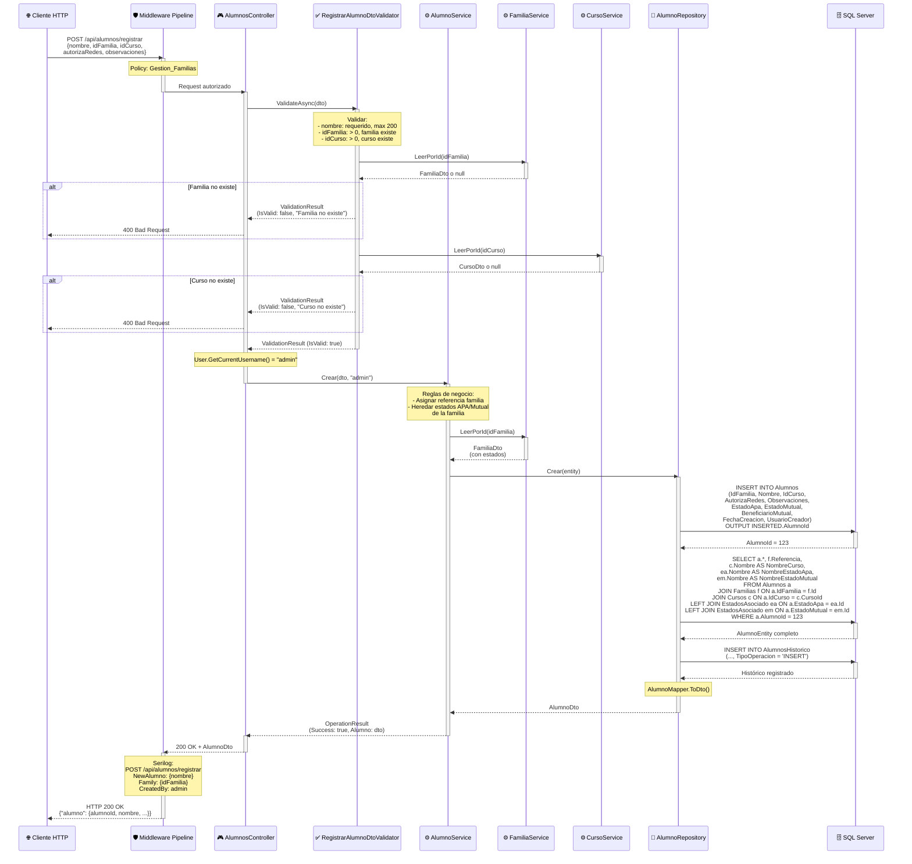
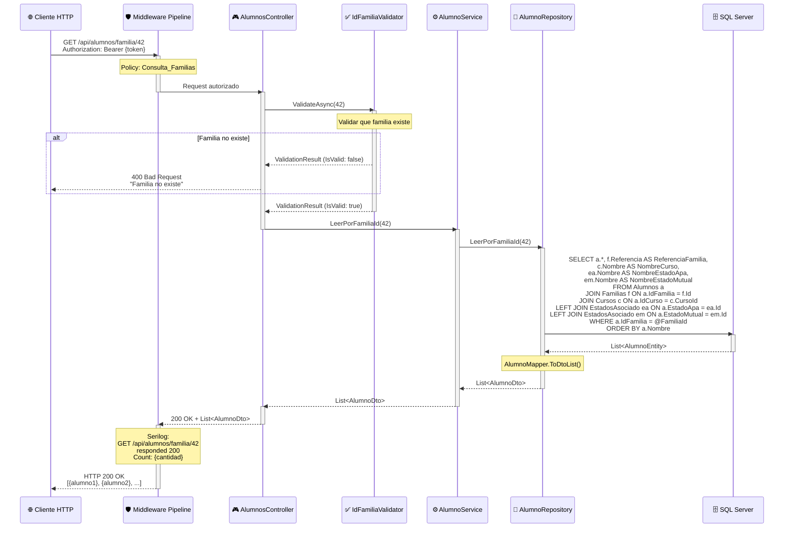
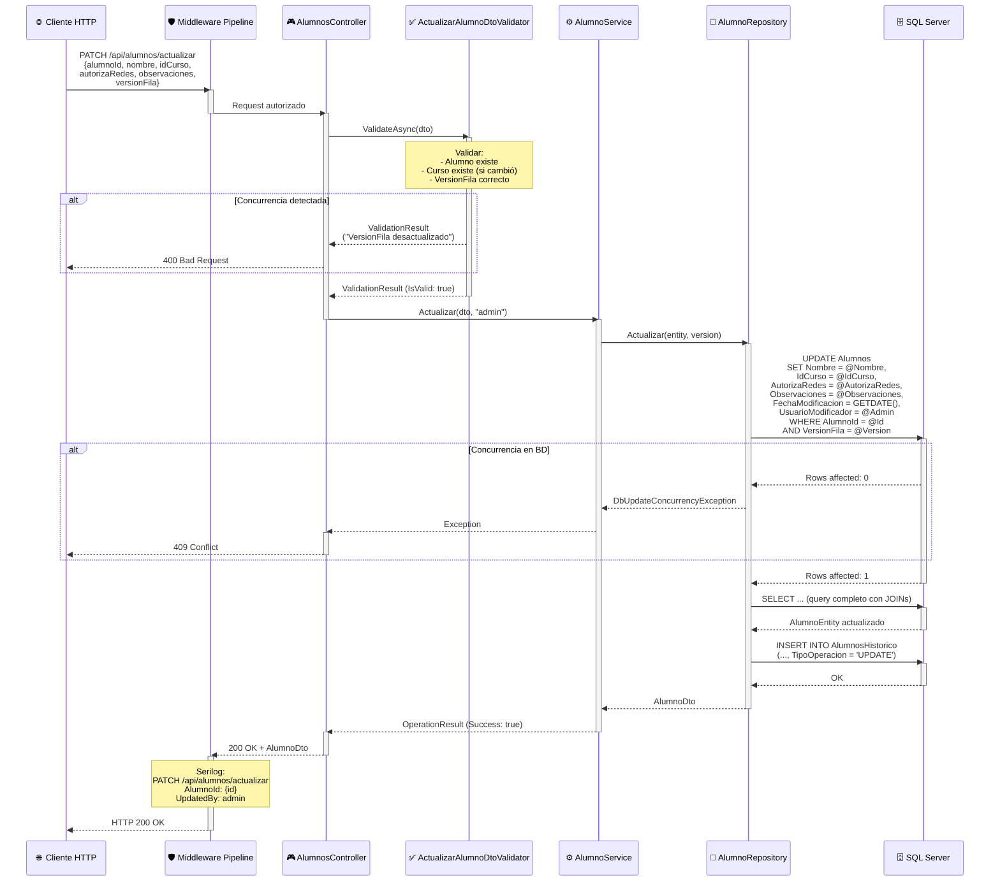

# 🎓 Diagramas de Secuencia - AlumnosController

Este documento contiene los diagramas de secuencia de los endpoints principales del **AlumnosController**.

---

## 📋 Endpoints Clave

1. [POST /api/alumnos/registrar](#1-post-apialumnosregistrar---registrar-nuevo-alumno)
2. [GET /api/alumnos/familia/{familiaId}](#2-get-apialumnosfamiliafamiliaid---obtener-alumnos-de-una-familia)
3. [PATCH /api/alumnos/actualizar](#3-patch-apialumnosactualizar---actualizar-alumno)

---

## 1. POST /api/alumnos/registrar - Registrar Nuevo Alumno

### 📌 Puntos Clave

1. **Validación Cruzada**: FluentValidation verifica que familia y curso existan antes de crear el alumno (previene registros huérfanos).
2. **Herencia de Estados**: El alumno hereda automáticamente los estados APA/Mutual de su familia (sincronización).
3. **JOIN Completo**: Una sola query recupera alumno + familia + curso + estados tras inserción (eficiencia).

---

## 2. GET /api/alumnos/familia/{familiaId} - Obtener Alumnos de una Familia

### 📌 Puntos Clave

1. **Query Eficiente**: Un solo JOIN trae todos los alumnos de la familia con sus relaciones (curso, estados).
2. **Ordenamiento Alfabético**: Alumnos ordenados por nombre para facilitar lectura.
3. **Caso de Uso Común**: Usado frecuentemente en vistas de detalle de familia (optimizado para performance).

---

## 3. PATCH /api/alumnos/actualizar - Actualizar Alumno

### 📌 Puntos Clave

1. **Control de Concurrencia**: VersionFila previene actualizaciones conflictivas (crítico en ediciones simultáneas).
2. **Cambio de Curso**: Validación asegura que el nuevo curso exista antes de actualizar (integridad referencial).
3. **Histórico Completo**: Se registra snapshot del estado actualizado con `TipoOperacion='UPDATE'`.

---

## 🔍 Otros Endpoints

### GET /api/alumnos/sin-familia
- **Propósito**: Listar alumnos huérfanos (sin familia asignada).
- **Query**: `SELECT * FROM Alumnos WHERE IdFamilia IS NULL`.
- **Caso de Uso**: Identificar alumnos que necesitan asignación familiar.

### GET /api/alumnos/curso/{cursoId}
- **Propósito**: Listar todos los alumnos de un curso específico.
- **Query**: `SELECT a.*, f.Nombre AS NombreFamilia FROM Alumnos a JOIN Familias f ON a.IdFamilia = f.Id WHERE a.IdCurso = @CursoId ORDER BY a.Nombre`.
- **Caso de Uso**: Generar listas de clase, informes por curso.

### POST /api/alumnos/filtrado
- **Propósito**: Búsqueda avanzada con múltiples filtros (nombre, curso, estado APA, etc.).
- **Implementación**: Similar a `/api/familias/filtrado` con SQL dinámico parameterizado.

---

## 🔒 Consideraciones Especiales

### ✅ Implementadas

- **Autorización de Redes Sociales**: Campo `AutorizaRedes` para GDPR compliance (consentimiento para publicar fotos).
- **Herencia de Estados**: Alumnos heredan estados APA/Mutual de su familia (sincronización automática).
- **Histórico de Cambios**: Tabla `AlumnosHistorico` con trazabilidad completa.
- **Soft Delete**: Alumnos marcados como `Activo = 0` en lugar de eliminación física.

### ⚠️ Recomendaciones Futuras

- **Paginación en Listados**: Implementar en endpoints que devuelven listas grandes.
- **Foto de Perfil**: Agregar campo `FotoUrl` y endpoint para subir imágenes.
- **Notificaciones**: Email a familia cuando se actualiza información del alumno.
- **Asignación Masiva**: Endpoint para cambiar curso de múltiples alumnos (promoción de curso).

---

**Última actualización**: 2024  
**Mantenido por**: DevJCTest  
**Compatibilidad**: .NET 8.0+
