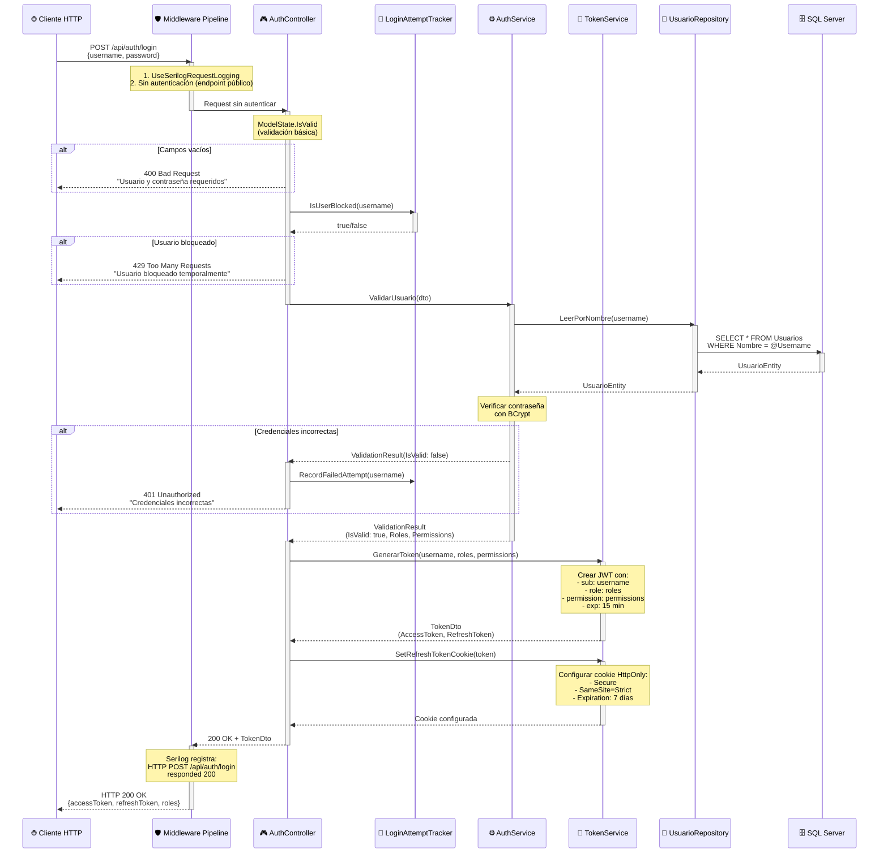
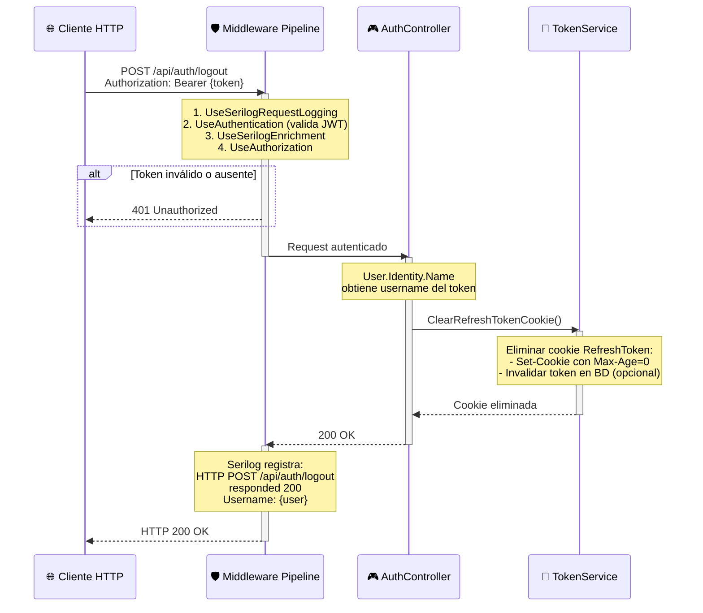
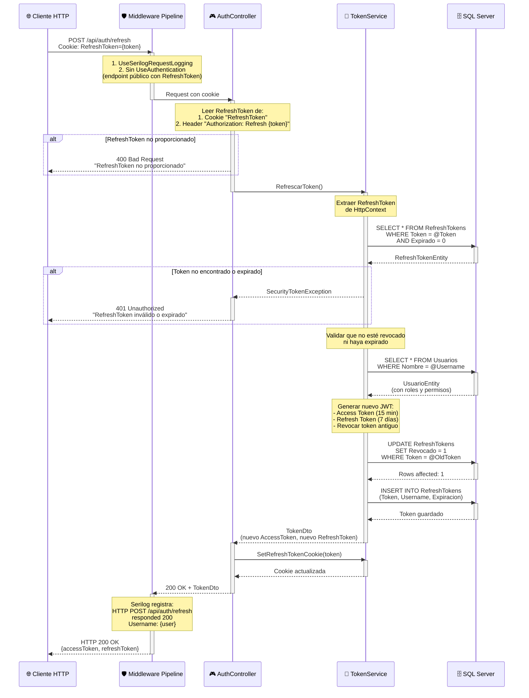

# 🔐 Diagramas de Secuencia - AuthController

Este documento contiene los diagramas de secuencia detallados de los endpoints del **AuthController**, responsable de la autenticación y gestión de tokens JWT en KindoHub API.

---

## 📋 Índice de Endpoints

1. [POST /api/auth/login](#1-post-apiauthlogin---iniciar-sesión)
2. [POST /api/auth/logout](#2-post-apiauthlogout---cerrar-sesión)
3. [POST /api/auth/refresh](#3-post-apiauthrefresh---renovar-token)

---

## 1. POST /api/auth/login - Iniciar Sesión

### 📌 Puntos Clave

1. **Protección contra Fuerza Bruta**: `LoginAttemptTracker` bloquea usuarios tras 5 intentos fallidos (bloqueo progresivo de 5-30 minutos).
2. **Hashing Seguro**: Las contraseñas se verifican con BCrypt, nunca se almacenan en texto plano.
3. **Tokens Duales**: Se generan Access Token (15 min) para autenticación y Refresh Token (7 días) en cookie HttpOnly para renovación segura.

---

## 2. POST /api/auth/logout - Cerrar Sesión

### 📌 Puntos Clave

1. **Endpoint Protegido**: Requiere token JWT válido en el header `Authorization: Bearer {token}`.
2. **Invalidación de Cookie**: Se elimina la cookie `RefreshToken` del cliente (HttpOnly, no accesible por JavaScript).
3. **Logging de Auditoría**: Serilog registra quién cerró sesión y cuándo para trazabilidad.

---

## 3. POST /api/auth/refresh - Renovar Token

### 📌 Puntos Clave

1. **Renovación Sin Reautenticación**: El cliente puede obtener un nuevo Access Token sin volver a enviar credenciales.
2. **Rotación de Tokens**: Cada renovación genera un nuevo Refresh Token y revoca el anterior (previene reuso de tokens robados).
3. **Persistencia Opcional**: Los Refresh Tokens pueden almacenarse en BD para permitir revocación inmediata (logout en todos los dispositivos).

---

## 🔒 Consideraciones de Seguridad

### ✅ Implementadas

- **HttpOnly Cookies**: Refresh Tokens en cookies inaccesibles por JavaScript (previene XSS).
- **Secure Flag**: Cookies solo transmitidas por HTTPS en producción.
- **SameSite=Strict**: Previene ataques CSRF.
- **Token Rotation**: Refresh Tokens rotados en cada renovación.
- **Rate Limiting**: Bloqueo progresivo tras intentos fallidos (5-30 minutos).
- **BCrypt Hashing**: Contraseñas hasheadas con factor de trabajo alto (10-12 rounds).

### ⚠️ Recomendaciones Futuras

- **Blacklist de Tokens**: Implementar lista negra de Access Tokens revocados (Redis recomendado).
- **Device Fingerprinting**: Validar que el Refresh Token se use desde el mismo dispositivo.
- **IP Whitelisting**: Opcional para usuarios administradores.
- **MFA (Multi-Factor Authentication)**: Autenticación de dos factores con TOTP.

---

**Última actualización**: 2024  
**Mantenido por**: DevJCTest  
**Compatibilidad**: .NET 8.0+
