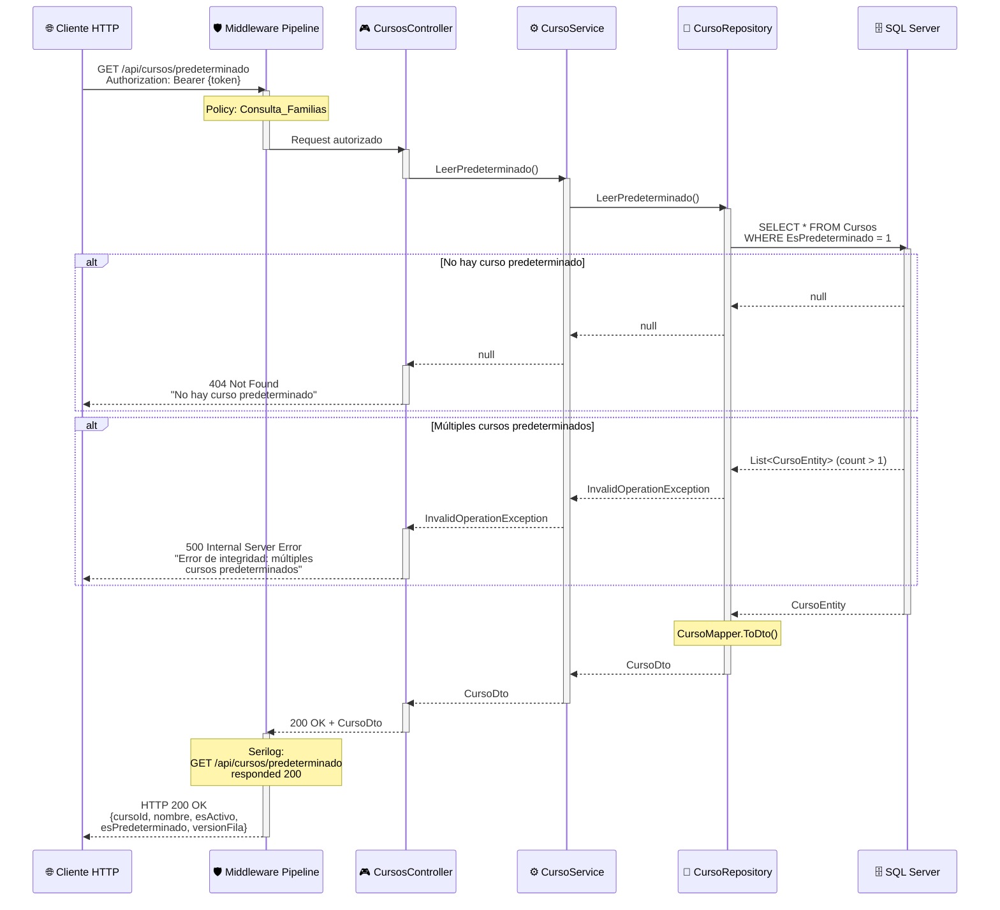
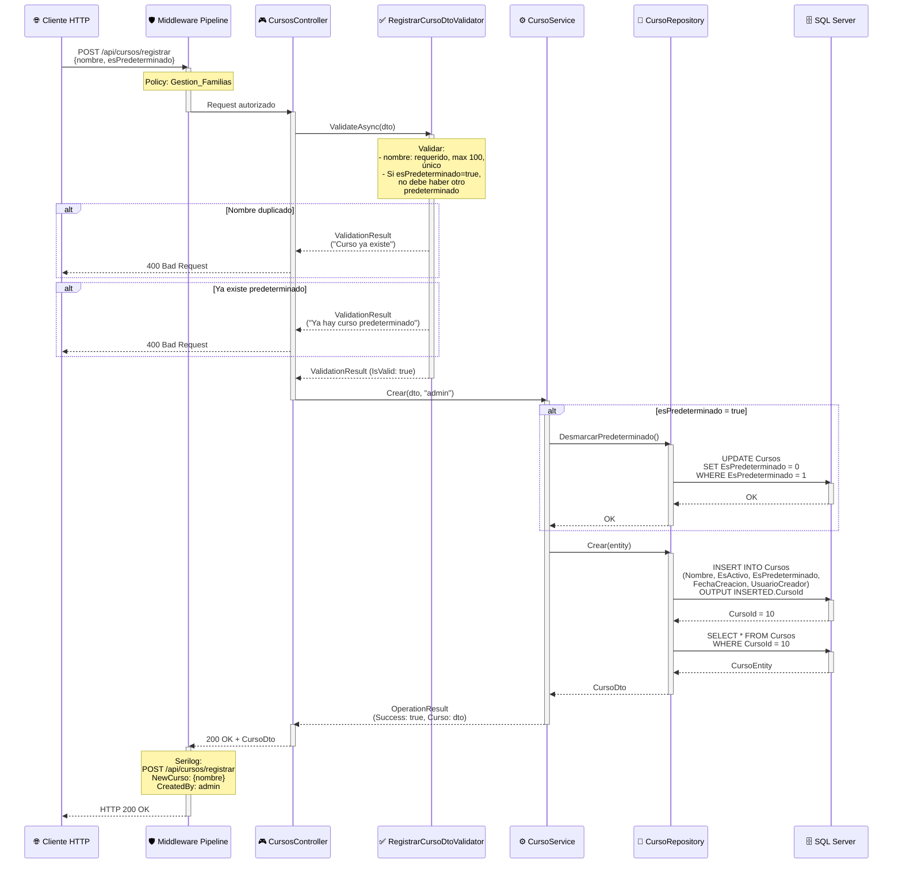
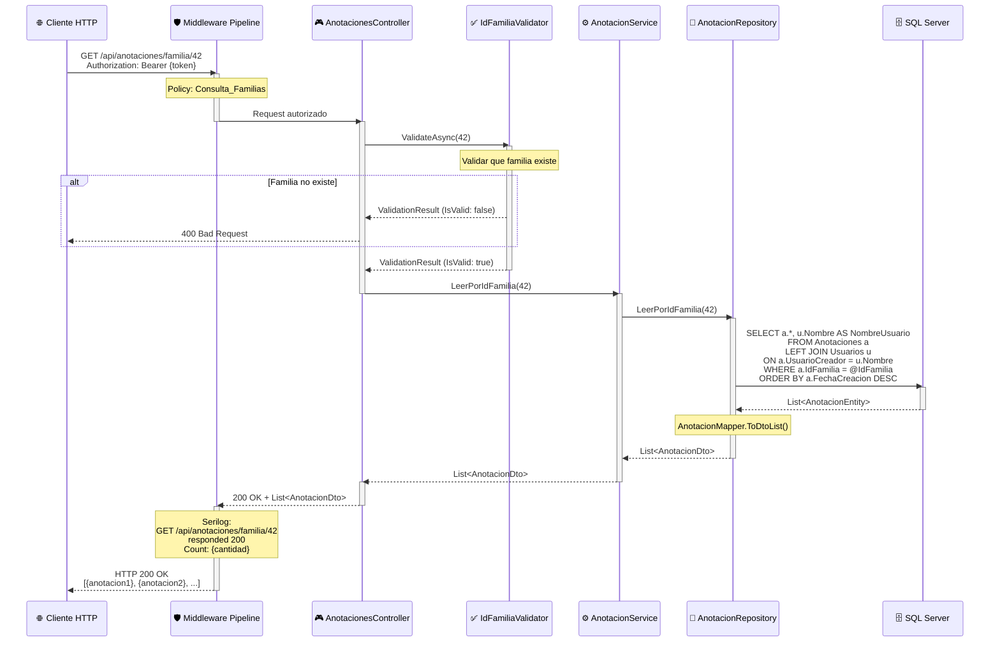
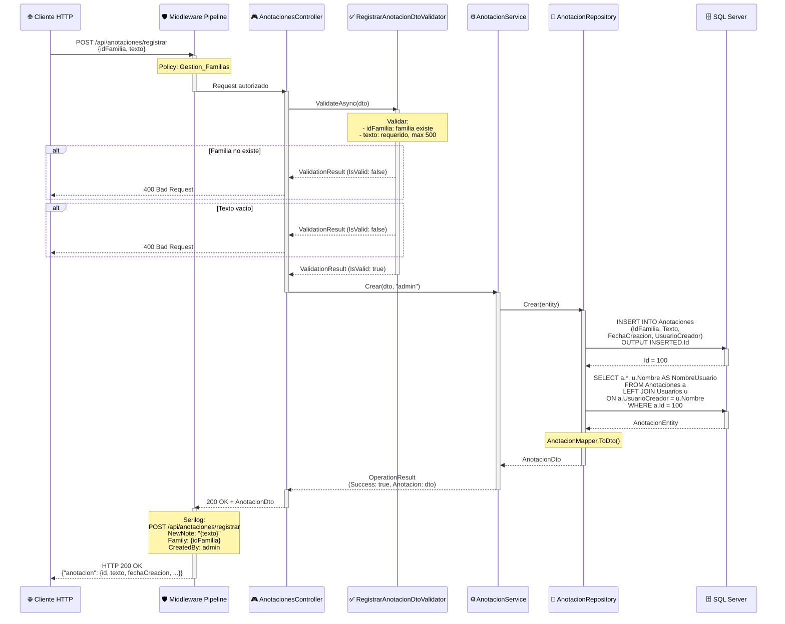

# 📚 Diagramas de Secuencia - CursosController & AnotacionesController

Este documento contiene los diagramas de secuencia de los **CursosController** y **AnotacionesController** (endpoints simples de catálogo).

---

## 🎓 CursosController

### 1. GET /api/cursos/predeterminado - Obtener Curso Predeterminado

### 📌 Puntos Clave - Cursos

1. **Curso Predeterminado Único**: Solo debe haber un curso con `EsPredeterminado = 1` (validado en BD con índice único).
2. **Uso en Registro de Alumnos**: El curso predeterminado se asigna automáticamente a nuevos alumnos si no se especifica uno.
3. **Integridad Crítica**: Validación de múltiples predeterminados previene inconsistencias en la BD.

---

## 2. POST /api/cursos/registrar - Registrar Nuevo Curso

### 📌 Puntos Clave - Registro de Cursos

1. **Predeterminado Único**: Si se marca como predeterminado, se desmarca automáticamente el anterior.
2. **Catálogo Centralizado**: Los cursos son catálogo maestro usado por alumnos (integridad referencial).
3. **Validación de Unicidad**: No pueden existir dos cursos con el mismo nombre.

---

## 📝 AnotacionesController

### 1. GET /api/anotaciones/familia/{idFamilia} - Obtener Anotaciones de Familia

### 📌 Puntos Clave - Anotaciones

1. **Orden Cronológico Inverso**: Las anotaciones más recientes aparecen primero (`ORDER BY FechaCreacion DESC`).
2. **Auditoría de Usuario**: Cada anotación muestra quién la creó/modificó (trazabilidad).
3. **Caso de Uso**: Notas importantes sobre familias (alergias, contactos adicionales, observaciones especiales).

---

## 2. POST /api/anotaciones/registrar - Crear Anotación

### 📌 Puntos Clave - Crear Anotación

1. **Texto Limitado**: Máximo 500 caracteres para mantener concisión (notas cortas).
2. **Timestamp Automático**: `FechaCreacion` se asigna automáticamente con `GETDATE()`.
3. **No Eliminación Física**: Anotaciones pueden marcarse como inactivas pero nunca se eliminan (auditoría).

---

## 🔍 Resumen de Endpoints Simples

### Cursos - Operaciones CRUD Básicas
- **GET /api/cursos**: Listar todos los cursos activos.
- **GET /api/cursos/{id}**: Obtener curso por ID.
- **POST /api/cursos/registrar**: Crear nuevo curso.
- **PATCH /api/cursos/actualizar**: Actualizar nombre o estado del curso.
- **DELETE /api/cursos**: Marcar curso como inactivo (soft delete).

### Anotaciones - Gestión de Notas
- **GET /api/anotaciones/{id}**: Obtener anotación específica por ID.
- **GET /api/anotaciones/familia/{idFamilia}**: Listar anotaciones de una familia.
- **POST /api/anotaciones/registrar**: Crear nueva anotación.
- **PATCH /api/anotaciones/actualizar**: Editar texto de anotación existente.
- **DELETE /api/anotaciones**: Eliminar anotación (soft delete).

---

## 🔒 Consideraciones de Seguridad

### ✅ Implementadas

- **Longitud Limitada**: Texto de anotaciones max 500 chars (previene abuso de almacenamiento).
- **Validación de FK**: No se pueden crear anotaciones para familias inexistentes.
- **Auditoría Completa**: `UsuarioCreador`, `UsuarioModificador`, `FechaCreacion`, `FechaModificacion`.
- **Control de Concurrencia**: VersionFila en actualizaciones de anotaciones.

### ⚠️ Recomendaciones Futuras

- **Rich Text**: Soporte para markdown o HTML sanitizado en anotaciones.
- **Adjuntos**: Permitir subir documentos PDF/imágenes asociados a anotaciones.
- **Notificaciones**: Enviar email a familia cuando se crea una anotación importante.
- **Categorización**: Agregar campo `Categoria` (ej: "Alergia", "Contacto", "Observación").

---

**Última actualización**: 2024  
**Mantenido por**: DevJCTest  
**Compatibilidad**: .NET 8.0+
