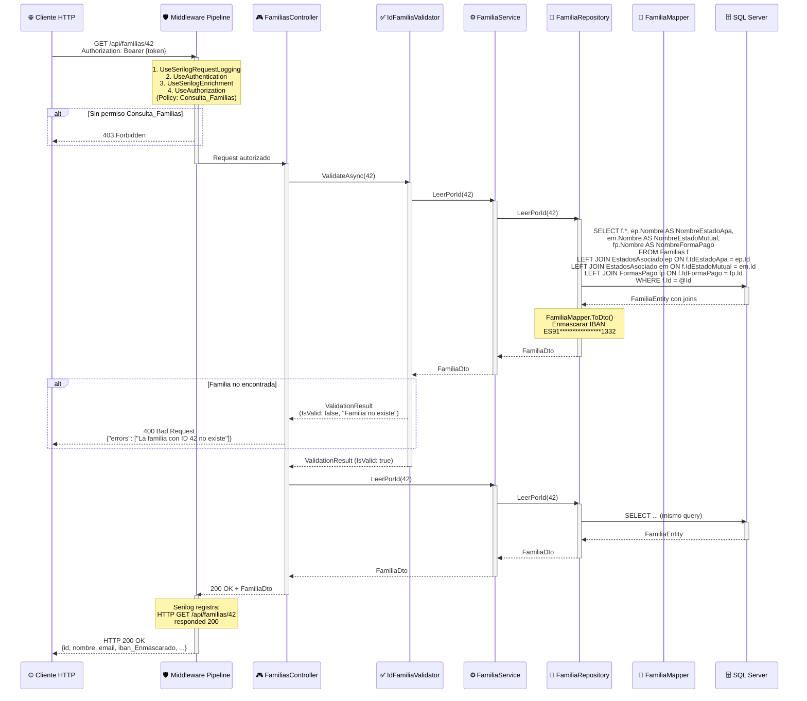
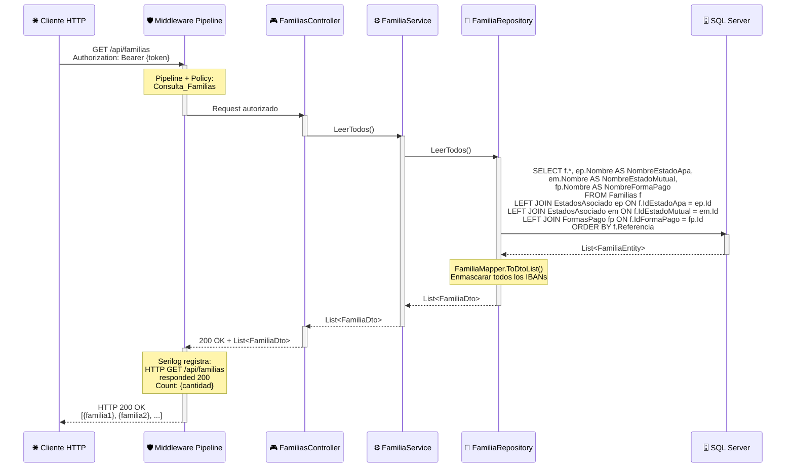
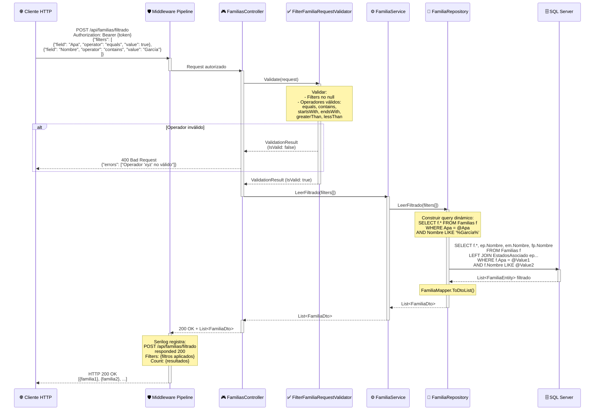
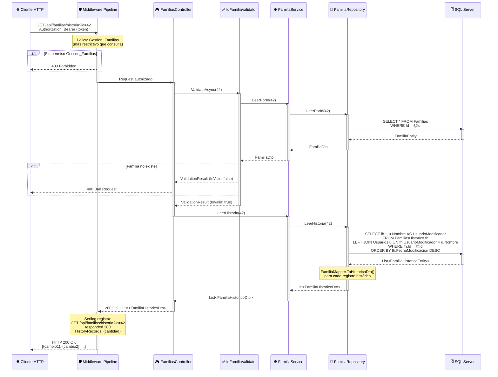
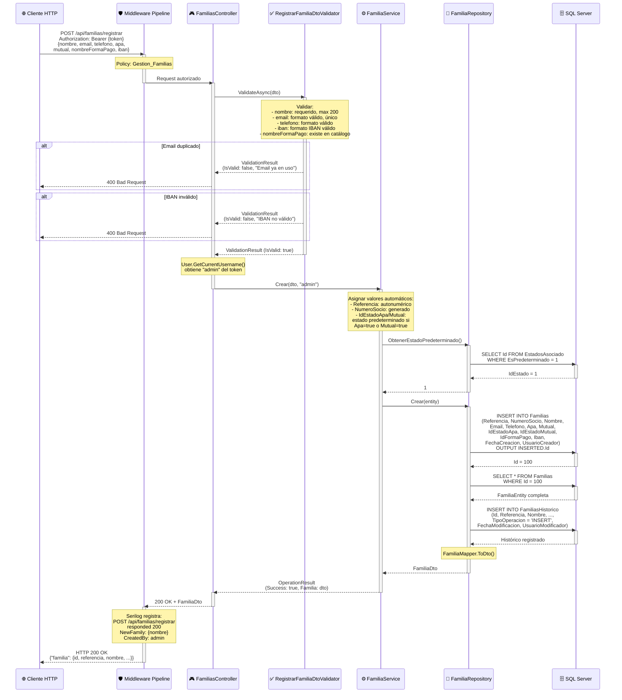
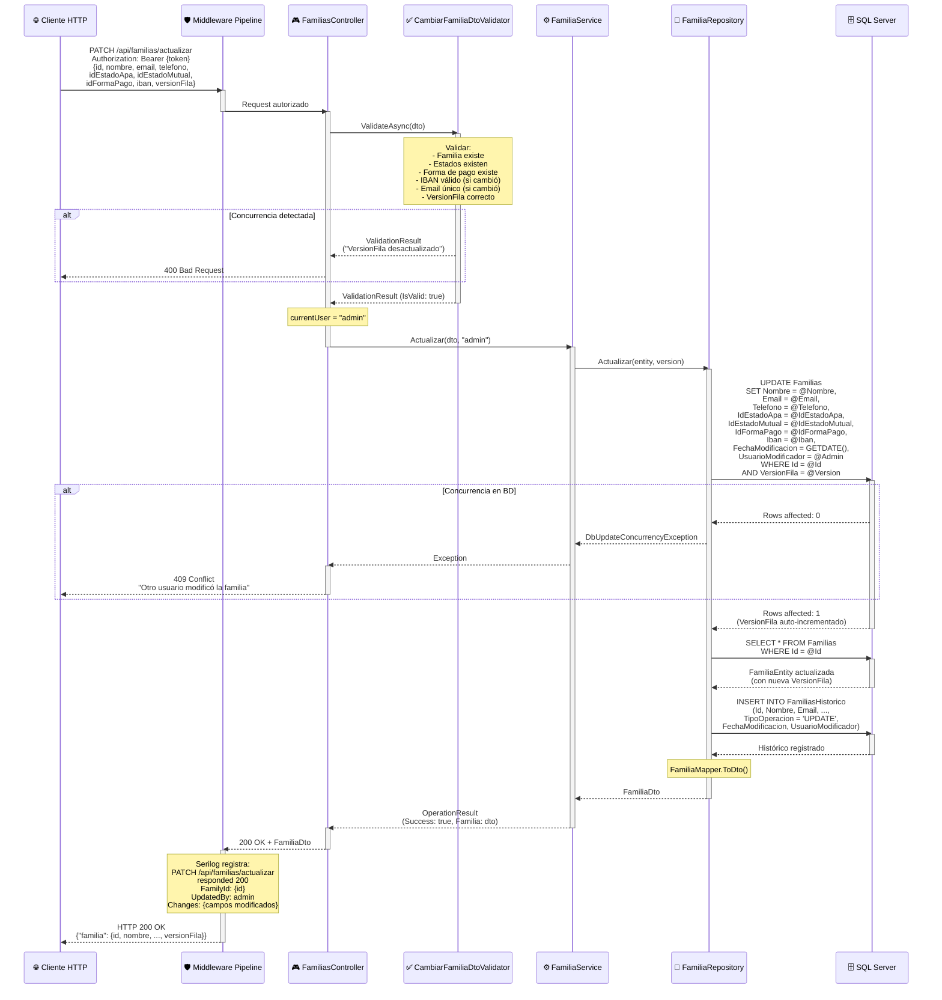
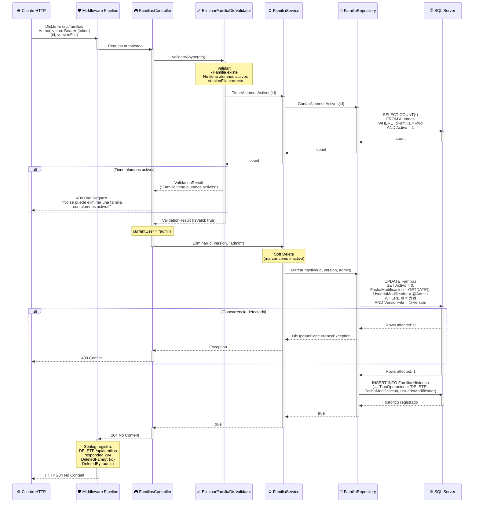

# 👨‍👩‍👧‍👦 Diagramas de Secuencia - FamiliasController

Este documento contiene los diagramas de secuencia detallados de los endpoints del **FamiliasController**, responsable de la gestión de familias en KindoHub API.

---

## 📋 Índice de Endpoints

1. [GET /api/familias/{id}](#1-get-apifamiliasid---obtener-familia-por-id)
2. [GET /api/familias](#2-get-apifamilias---listar-todas-las-familias)
3. [POST /api/familias/filtrado](#3-post-apifamiliasfiltrado---obtener-familias-filtradas)
4. [GET /api/familias/historia?id={id}](#4-get-apifamiliashistoriaid---obtener-historial-de-cambios)
5. [POST /api/familias/registrar](#5-post-apifamiliasregistrar---registrar-nueva-familia)
6. [PATCH /api/familias/actualizar](#6-patch-apifamiliasactualizar---actualizar-familia)
7. [DELETE /api/familias](#7-delete-apifamilias---eliminar-familia)

---

## 1. GET /api/familias/{id} - Obtener Familia por ID

### 📌 Puntos Clave

1. **Autorización por Política**: Requiere claim `permission=Consulta_Familias` (más granular que roles).
2. **JOINs Eficientes**: Una sola query trae familia + estados + forma de pago (evita N+1 queries).
3. **Enmascaramiento de IBAN**: Por seguridad, se devuelve `ES91****************1332` en lugar del IBAN completo.

---

## 2. GET /api/familias - Listar Todas las Familias

### 📌 Puntos Clave

1. **Sin Paginación Actual**: Devuelve TODAS las familias (recomendado implementar paginación si >500 familias).
2. **Ordenamiento por Referencia**: Familias ordenadas por `Referencia` (número correlativo interno).
3. **Performance**: Un solo roundtrip a BD gracias a JOINs (crítico con muchas familias).

---

## 3. POST /api/familias/filtrado - Obtener Familias Filtradas

### 📌 Puntos Clave

1. **Filtrado Dinámico**: Los filtros se convierten en cláusulas WHERE dinámicas (usando SQL parameterizado para prevenir SQL injection).
2. **Operadores Soportados**: `equals`, `contains`, `startsWith`, `endsWith`, `greaterThan`, `lessThan`.
3. **Performance Crítico**: Los filtros deben aplicarse sobre columnas indexadas (ej: `Referencia`, `NumeroSocio`).

---

## 4. GET /api/familias/historia?id={id} - Obtener Historial de Cambios

### 📌 Puntos Clave

1. **Tabla de Auditoría**: `FamiliasHistorico` almacena cada cambio (quién, cuándo, qué campos cambiaron).
2. **Permisos Elevados**: Solo usuarios con `Gestion_Familias` pueden ver el historial (previene espionaje).
3. **Ordenamiento Cronológico**: Los cambios más recientes aparecen primero (`ORDER BY FechaModificacion DESC`).

---

## 5. POST /api/familias/registrar - Registrar Nueva Familia

### 📌 Puntos Clave

1. **Generación Automática**: `Referencia` y `NumeroSocio` se asignan automáticamente (autonuméricos o secuencias).
2. **Estados Predeterminados**: Si `Apa=true` o `Mutual=true`, se asigna automáticamente el estado predeterminado.
3. **Auditoría Doble**: Se registra en `FamiliasHistorico` con `TipoOperacion='INSERT'` para trazabilidad completa.

---

## 6. PATCH /api/familias/actualizar - Actualizar Familia

### 📌 Puntos Clave

1. **Control de Concurrencia Obligatorio**: SQL Server actualiza `VersionFila` automáticamente (tipo `rowversion`/`timestamp`).
2. **Actualización Parcial**: Solo se actualizan campos incluidos en el DTO (no sobrescribe campos no enviados).
3. **Histórico de Cambios**: Se registra `TipoOperacion='UPDATE'` con snapshot completo del estado nuevo.

---

## 7. DELETE /api/familias - Eliminar Familia

### 📌 Puntos Clave

1. **Soft Delete**: Familias NO se eliminan físicamente, solo se marca `Activo = 0` (permite recuperación).
2. **Validación de Integridad**: No se puede eliminar una familia con alumnos activos (previene huérfanos).
3. **Auditoría de Eliminación**: Se registra `TipoOperacion='DELETE'` con snapshot del estado previo.

---

## 🔒 Consideraciones de Seguridad y Performance

### ✅ Implementadas

- **Control de Concurrencia**: `VersionFila` (rowversion) en todas las operaciones de escritura.
- **Enmascaramiento de IBAN**: Datos sensibles ocultos en respuestas (`ES91****************1332`).
- **Validación de IBAN**: Algoritmo mod-97 implementado en FluentValidation.
- **JOINs Eficientes**: Una sola query trae familia + relaciones (evita N+1).
- **Soft Delete**: Preservación de datos para auditorías y recuperación.
- **Histórico Completo**: Tabla `FamiliasHistorico` con snapshots de cada cambio.

### ⚠️ Recomendaciones Futuras

- **Paginación**: Implementar en `GET /api/familias` (ej: `?page=1&pageSize=50`).
- **Índices en Filtrado**: Crear índices en columnas comúnmente filtradas (`Nombre`, `Email`, `NumeroSocio`).
- **Cache de Catálogos**: Cachear FormasPago y EstadosAsociado en Redis (evitar queries repetitivas).
- **Validación de Email**: Enviar email de confirmación tras registro/actualización de email.
- **GDPR Compliance**: Implementar endpoint para exportar datos de familia en JSON/PDF.

---

**Última actualización**: 2024  
**Mantenido por**: DevJCTest  
**Compatibilidad**: .NET 8.0+
