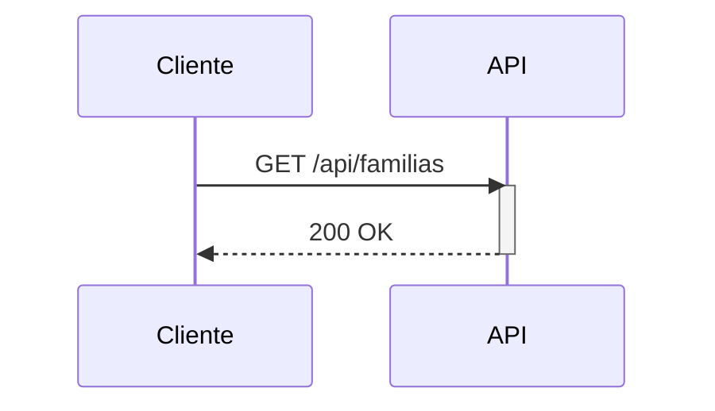

# 📊 Diagramas de Secuencia - KindoHub API

Esta carpeta contiene diagramas de secuencia detallados (Mermaid.js) de todos los endpoints de la API KindoHub, mostrando el flujo completo de cada petición HTTP desde el cliente hasta la base de datos.

---

## 📑 Índice de Documentos

### 🔐 Autenticación y Seguridad
- **[AUTH_SEQUENCE.md](AUTH_SEQUENCE.md)** - Endpoints de autenticación
  - `POST /api/auth/login` - Iniciar sesión con credenciales
  - `POST /api/auth/logout` - Cerrar sesión
  - `POST /api/auth/refresh` - Renovar Access Token

### 👥 Gestión de Usuarios
- **[USUARIOS_SEQUENCE.md](USUARIOS_SEQUENCE.md)** - CRUD de usuarios del sistema
  - `GET /api/usuarios/{username}` - Obtener usuario por nombre
  - `GET /api/usuarios` - Listar todos los usuarios
  - `POST /api/usuarios/register` - Registrar nuevo usuario
  - `PATCH /api/usuarios/change-password` - Cambiar contraseña
  - `DELETE /api/usuarios` - Eliminar usuario (soft delete)

### 👨‍👩‍👧‍👦 Gestión de Familias
- **[FAMILIAS_SEQUENCE.md](FAMILIAS_SEQUENCE.md)** - CRUD completo de familias
  - `GET /api/familias/{id}` - Obtener familia por ID
  - `GET /api/familias` - Listar todas las familias
  - `POST /api/familias/filtrado` - Búsqueda con filtros personalizados
  - `GET /api/familias/historia?id={id}` - Historial de cambios
  - `POST /api/familias/registrar` - Registrar nueva familia
  - `PATCH /api/familias/actualizar` - Actualizar datos de familia
  - `DELETE /api/familias` - Eliminar familia (soft delete)

### 🎓 Gestión de Alumnos
- **[ALUMNOS_SEQUENCE.md](ALUMNOS_SEQUENCE.md)** - CRUD de alumnos con validaciones cruzadas
  - `POST /api/alumnos/registrar` - Registrar nuevo alumno
  - `GET /api/alumnos/familia/{familiaId}` - Alumnos de una familia
  - `PATCH /api/alumnos/actualizar` - Actualizar datos de alumno
  - Otros endpoints: `/sin-familia`, `/curso/{cursoId}`, `/filtrado`

### 📚 Catálogos y Anotaciones
- **[CURSOS_ANOTACIONES_SEQUENCE.md](CURSOS_ANOTACIONES_SEQUENCE.md)** - Gestión de cursos y anotaciones
  - **Cursos**: `GET`, `POST`, `PATCH`, `DELETE` + `/predeterminado`
  - **Anotaciones**: `GET`, `POST`, `PATCH`, `DELETE` + `/familia/{id}`

---

## 🎨 Convenciones de Diagramas

### Participantes Estándar

Todos los diagramas utilizan los mismos participantes con iconos emoji para claridad:

| Participante | Icono | Descripción |
|-------------|-------|-------------|
| **Cliente HTTP** | 🌐 | Aplicación frontend, Postman, curl, etc. |
| **Middleware Pipeline** | 🛡️ | Pipeline de ASP.NET Core (autenticación, logging, autorización) |
| **Controller** | 🎮 | Controlador de API (ej: FamiliasController) |
| **Validator** | ✅ | FluentValidation para validaciones complejas |
| **Service** | ⚙️ | Capa de lógica de negocio (ej: FamiliaService) |
| **Repository** | 💾 | Capa de acceso a datos (ej: FamiliaRepository) |
| **Mapper** | 🔄 | Transformers para Entity ↔ DTO |
| **Database** | 🗄️ | SQL Server |

### Códigos de Color (en cajas activate/deactivate)

- **Verde**: Operación exitosa
- **Rojo**: Error de validación o excepción
- **Amarillo**: Advertencia o validación condicional

### Notas en Diagramas

Las cajas `Note over` muestran:
- **Middleware**: Pasos del pipeline (autenticación, logging, etc.)
- **Validador**: Reglas de validación aplicadas
- **Servicio**: Lógica de negocio ejecutada
- **Repositorio**: Queries SQL ejecutadas
- **Serilog**: Logs generados automáticamente

---

## 📖 Cómo Leer los Diagramas

### Ejemplo: Flujo de Registro de Familia

1. **Cliente** envía `POST /api/familias/registrar` con datos JSON + JWT token
2. **Middleware Pipeline** valida el token JWT y verifica permisos (`Gestion_Familias`)
3. **Controller** recibe la petición y delega al **Validator**
4. **Validator** ejecuta reglas de FluentValidation:
   - Nombre requerido, email válido, IBAN correcto, etc.
   - Verifica que `nombreFormaPago` exista en catálogo
5. **Service** aplica lógica de negocio:
   - Asigna `Referencia` y `NumeroSocio` autonuméricos
   - Asigna estados predeterminados si `Apa=true` o `Mutual=true`
6. **Repository** ejecuta SQL:
   - `INSERT INTO Familias ...` con parámetros sanitizados
   - `INSERT INTO FamiliasHistorico ...` para auditoría
7. **Mapper** transforma `FamiliaEntity` → `FamiliaDto` (enmascarando IBAN)
8. **Controller** devuelve `200 OK` con el DTO creado
9. **Middleware** registra en Serilog: `POST /api/familias/registrar responded 200`

---

## 🔍 Casos de Uso de los Diagramas

### Para Desarrolladores

- **Onboarding**: Entender rápidamente cómo funciona cada endpoint sin leer código.
- **Debugging**: Identificar en qué capa ocurre un error (Controller, Service, Repository, DB).
- **Testing**: Diseñar tests unitarios/integración basados en los flujos.
- **Code Review**: Validar que la implementación sigue el patrón arquitectónico.

### Para QA/Testers

- **Casos de Prueba**: Derivar escenarios de prueba de los flujos (happy path + error paths).
- **Validaciones**: Identificar qué validaciones deben probarse en cada endpoint.
- **Códigos HTTP**: Conocer qué códigos de respuesta esperar (200, 400, 401, 409, 500).

### Para Documentación

- **API Reference**: Complementar la documentación técnica con diagramas visuales.
- **Training**: Material para capacitación de nuevos desarrolladores.
- **Arquitectura**: Mostrar cómo la arquitectura en capas se aplica en la práctica.

---

## 🛠️ Herramientas Recomendadas

### Visualizar Diagramas Mermaid

Los diagramas están escritos en **Mermaid.js** y se pueden visualizar en:

1. **GitHub/GitLab**: Renderizado automático en archivos `.md`
2. **VS Code**: Extensión [Markdown Preview Mermaid Support](https://marketplace.visualstudio.com/items?itemName=bierner.markdown-mermaid)
3. **Mermaid Live Editor**: [https://mermaid.live/](https://mermaid.live/) (copiar/pegar código)
4. **Notion/Confluence**: Soporte nativo de Mermaid en bloques de código

### Editar Diagramas

Para modificar un diagrama:

1. Abre el archivo `.md` correspondiente
2. Localiza el bloque ` ```mermaid ... ``` `
3. Edita la sintaxis Mermaid (sintaxis similar a PlantUML)
4. Previsualiza con cualquiera de las herramientas anteriores

**Ejemplo de sintaxis**:


---

## 📚 Recursos Adicionales

### Documentación Oficial

- [Mermaid.js Documentation](https://mermaid.js.org/)
- [Sequence Diagrams Guide](https://mermaid.js.org/syntax/sequenceDiagram.html)
- [C4 Model for Software Architecture](https://c4model.com/)

### Otros Documentos del Proyecto

- [API Reference](../API_REFERENCE.md) - Referencia técnica de endpoints
- [Architecture](../ARCHITECTURE.md) - Arquitectura general del sistema
- [OpenAPI Guide](../OPENAPI_GUIDE.md) - Uso de Swagger y generación de clientes
- [Security](../SECURITY.md) - Consideraciones de seguridad

---

## 🔄 Actualización de Diagramas

### Cuándo Actualizar

Los diagramas deben actualizarse cuando:

- ✅ Se agrega un nuevo endpoint
- ✅ Se modifica el flujo de un endpoint existente (ej: nueva validación)
- ✅ Se agrega/elimina un participante (ej: nuevo servicio intermedio)
- ✅ Cambian las reglas de negocio de un endpoint

### Proceso de Actualización

1. **Modificar el código**: Implementa el cambio en el código fuente
2. **Actualizar el diagrama**: Edita el archivo `.md` correspondiente
3. **Validar sintaxis**: Previsualiza en Mermaid Live Editor
4. **Actualizar puntos clave**: Revisa la sección "📌 Puntos Clave" al final del diagrama
5. **Commit**: Incluye el diagrama actualizado en el mismo commit que el código

---

## 📞 Contacto y Soporte

Si encuentras errores en los diagramas o tienes sugerencias de mejora:

1. **GitHub Issues**: Abre un issue en el repositorio
2. **Pull Request**: Envía un PR con la corrección
3. **Discusión**: Inicia una discusión en GitHub Discussions

---

**Última actualización**: 2024  
**Mantenido por**: DevJCTest  
**Versión**: 1.0

---

**Happy Diagramming! 📊**
