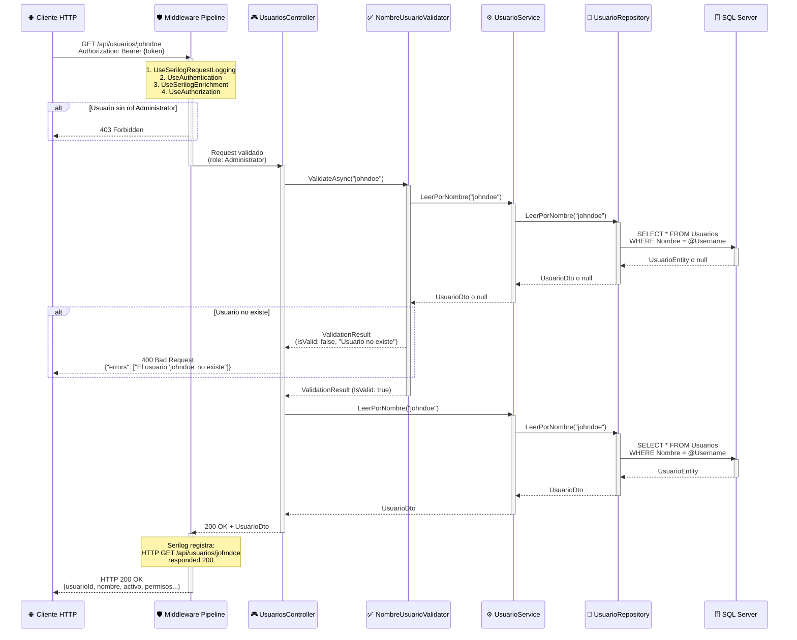
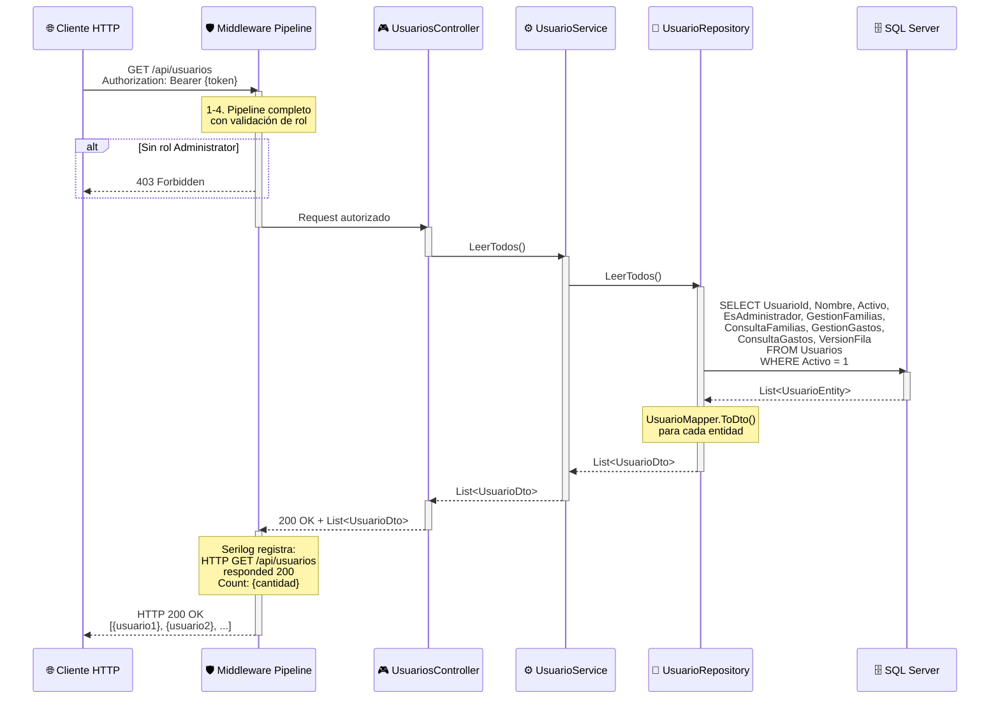
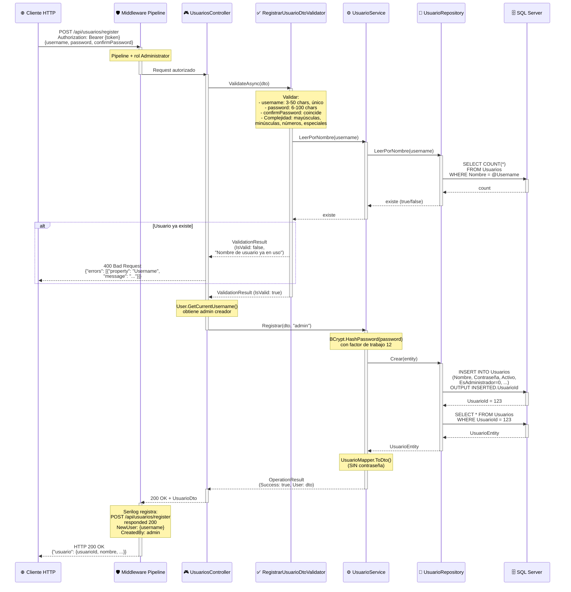
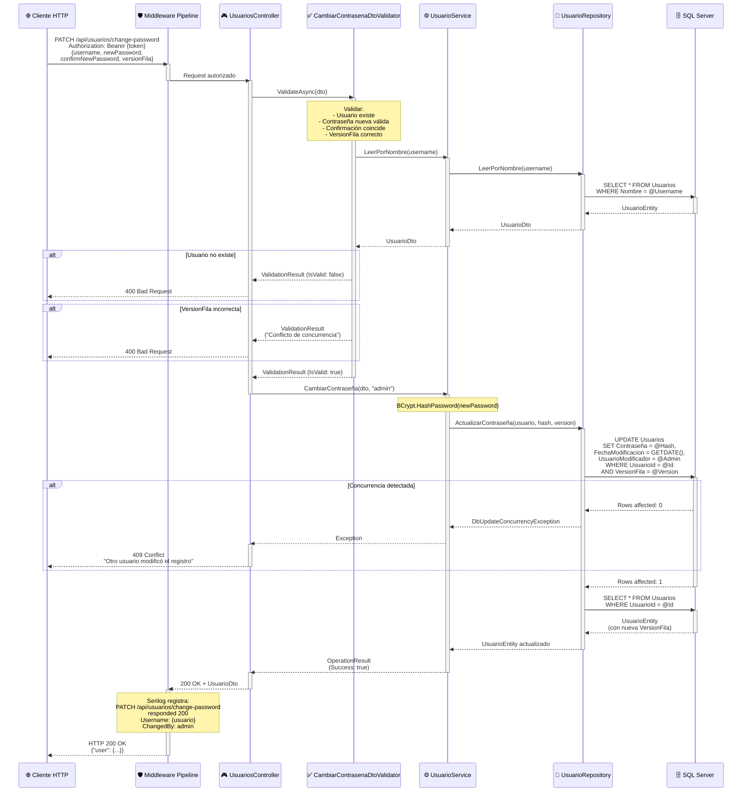
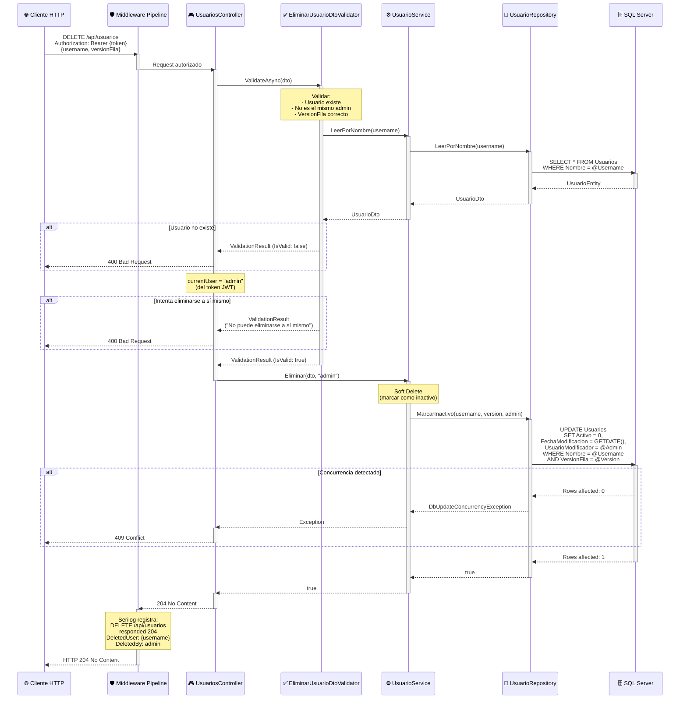
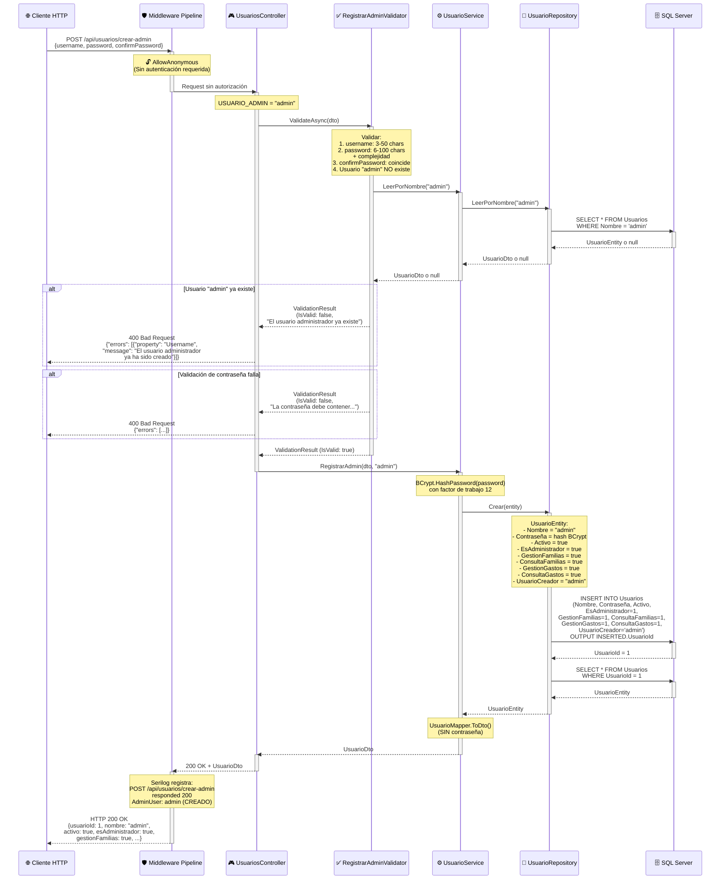

# 👥 Diagramas de Secuencia - UsuariosController

Este documento contiene los diagramas de secuencia detallados de los endpoints del **UsuariosController**, responsable de la gestión de usuarios en KindoHub API.

---

## 📋 Índice de Endpoints

1. [GET /api/usuarios/{username}](#1-get-apiusuariosusername---obtener-usuario-por-nombre)
2. [GET /api/usuarios](#2-get-apiusuarios---listar-todos-los-usuarios)
3. [POST /api/usuarios/register](#3-post-apiusuariosregister---registrar-nuevo-usuario)
4. [PATCH /api/usuarios/change-password](#4-patch-apiusuarioschange-password---cambiar-contraseña)
5. [DELETE /api/usuarios](#5-delete-apiusuarios---eliminar-usuario)
6. [POST /api/usuarios/crear-admin](#6-post-apiusuarioscrear-admin---crear-usuario-administrador-inicial)

---

## 1. GET /api/usuarios/{username} - Obtener Usuario por Nombre

### 📌 Puntos Clave

1. **Autorización por Rol**: Solo usuarios con rol `Administrator` pueden consultar información de otros usuarios.
2. **Validación Doble**: FluentValidation verifica que el usuario exista antes de intentar leerlo (evita queries innecesarias).
3. **DTOs Sin Contraseñas**: La respuesta NUNCA incluye el hash de contraseña por seguridad.

---

## 2. GET /api/usuarios - Listar Todos los Usuarios

### 📌 Puntos Clave

1. **Solo Usuarios Activos**: Por defecto, solo se listan usuarios con `Activo = 1` (usuarios desactivados no aparecen).
2. **Sin Paginación Actual**: Recomendado implementar paginación si hay >100 usuarios (evitar sobrecarga).
3. **Permisos Granulares**: Cada usuario tiene flags booleanos para permisos individuales (GestionFamilias, ConsultaFamilias, etc.).

---

## 3. POST /api/usuarios/register - Registrar Nuevo Usuario

### 📌 Puntos Clave

1. **Validación de Contraseña Compleja**: FluentValidation requiere al menos mayúsculas, minúsculas, números y caracteres especiales.
2. **Hashing con BCrypt**: Factor de trabajo 12 (4096 iteraciones) para resistir ataques de fuerza bruta.
3. **Auditoría de Creación**: Se registra quién creó el usuario (`UsuarioCreador`) para trazabilidad completa.

---

## 4. PATCH /api/usuarios/change-password - Cambiar Contraseña

### 📌 Puntos Clave

1. **Control de Concurrencia Optimista**: El campo `VersionFila` (rowversion) previene actualizaciones simultáneas conflictivas.
2. **Auditoría de Cambios**: Se registra quién cambió la contraseña y cuándo (`UsuarioModificador`, `FechaModificacion`).
3. **Rehashing Obligatorio**: Cada cambio de contraseña genera un nuevo hash BCrypt (previene reuso de hashes antiguos).

---

## 5. DELETE /api/usuarios - Eliminar Usuario

### 📌 Puntos Clave

1. **Soft Delete**: Los usuarios NO se eliminan físicamente de la BD, solo se marca `Activo = 0` (permite recuperación y auditoría).
2. **Protección contra Auto-Eliminación**: Un administrador no puede eliminarse a sí mismo (previene lockout accidental).
3. **Concurrencia en Eliminación**: VersionFila garantiza que no se elimine un usuario modificado por otro admin simultáneamente.

---

## 6. POST /api/usuarios/crear-admin - Crear Usuario Administrador Inicial

### 📌 Puntos Clave

1. **Endpoint de Inicialización**: Este endpoint está diseñado para crear el **primer usuario administrador** del sistema.
2. **Sin Autenticación**: Marcado con `[AllowAnonymous]` para permitir la creación inicial cuando no hay usuarios en el sistema.
3. **Protección contra Duplicados**: Solo puede ejecutarse **una vez**. Si el usuario "admin" ya existe, retorna error 400.
4. **Permisos Completos**: El usuario administrador se crea con todos los permisos habilitados:
   - `EsAdministrador = true`
   - `GestionFamilias = true`
   - `ConsultaFamilias = true`
   - `GestionGastos = true`
   - `ConsultaGastos = true`
5. **Auto-Auditoría**: El campo `UsuarioCreador` se establece como "admin" (se crea a sí mismo).
6. **Validación de Contraseña Robusta**: Mismo nivel de seguridad que `/register` (complejidad obligatoria).

### ⚠️ Consideraciones de Seguridad

- **Exposición Pública**: Este endpoint es accesible sin autenticación, lo que representa un riesgo si no se protege adecuadamente.
- **Recomendaciones**:
  - ✅ **Deshabilitar en producción** después de la creación inicial del admin.
  - ✅ **Proteger con IP Whitelisting** o restricciones de red.
  - ✅ **Implementar rate limiting** para prevenir intentos de fuerza bruta.
  - ✅ **Monitoreo activo**: Alertar en caso de múltiples intentos fallidos.

---

## 🔒 Consideraciones de Seguridad

### ✅ Implementadas

- **Control de Concurrencia**: VersionFila (rowversion) en todas las operaciones de escritura.
- **Soft Delete**: Preservación de datos para auditorías.
- **Auditoría Completa**: Campos `UsuarioCreador`, `UsuarioModificador`, `FechaCreacion`, `FechaModificacion`.
- **BCrypt con Factor 12**: Resistencia a ataques de fuerza bruta (4096 iteraciones).
- **Validación de Contraseñas**: Complejidad obligatoria (mayúsculas, minúsculas, números, especiales).

### ⚠️ Recomendaciones Futuras

- **Política de Expiración de Contraseñas**: Forzar cambio cada 90 días.
- **Historial de Contraseñas**: Prevenir reuso de las últimas 5 contraseñas.
- **Notificación de Cambios**: Email al usuario cuando se cambia su contraseña.
- **Reactivación de Usuarios**: Endpoint para marcar `Activo = 1` en lugar de crear uno nuevo.

---

**Última actualización**: 2024  
**Mantenido por**: DevJCTest  
**Compatibilidad**: .NET 8.0+
